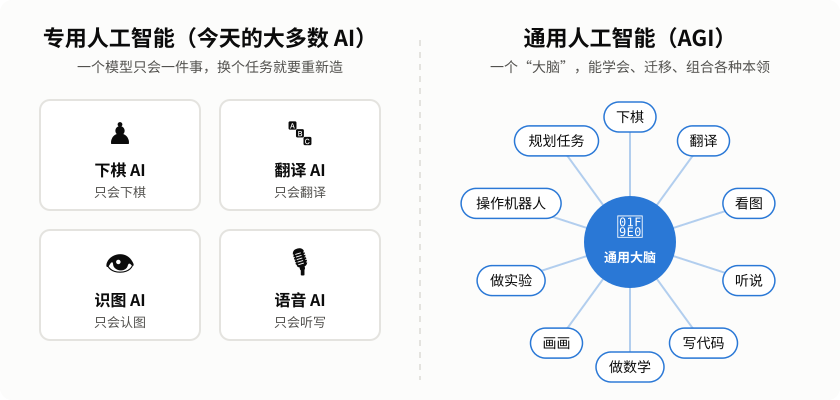
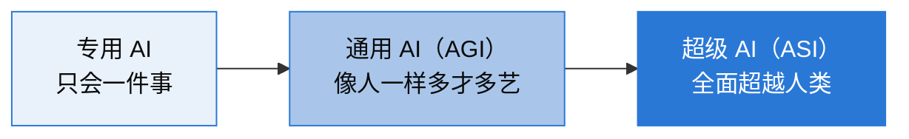

# 通用人工智能系列（一）：什么是通用人工智能？

> 本系列共四篇，用尽量通俗的语言，讲清楚通用人工智能（AGI）的来龙去脉。
> 这是第一篇：先把“AGI 到底是什么”说明白。
>
> [系列目录](README.md) ｜ 下一篇：[七十年风雨路 →](02-history.md)

---

## 一、从一个问题开始：你身边的 AI 聪明吗？

手机能认出照片里的猫，导航软件能算出最快路线，围棋程序能打败世界冠军，聊天机器人能写诗、写代码、陪你聊天。

看起来 AI 已经无所不能了。但请想一想：

- 打败世界冠军的围棋程序，**会不会帮你订一张火车票？**
- 能认出猫的图像模型，**能不能听懂你说的一句话？**
- 能写一整篇文章的聊天机器人，**能不能端起一杯水、不洒出来？**

答案基本都是“不能”，或者“做得很勉强”。

这就引出了本系列的主角——**通用人工智能**（Artificial General Intelligence，简称 **AGI**）。

## 二、专用 AI 与通用 AI

  

我们可以把 AI 分成两大类：

| | 专用人工智能（Narrow AI） | 通用人工智能（AGI） |
|---|---|---|
| 打个比方 | **一把专用工具**：螺丝刀只能拧螺丝 | **一个聪明的学徒**：什么都能学 |
| 能力范围 | 一个模型只擅长一件事 | 能在大多数任务上达到人类水平 |
| 遇到新任务 | 需要工程师重新收集数据、重新训练 | 自己看说明、举一反三、很快上手 |
| 典型例子 | 人脸识别、AlphaGo、推荐算法 | 目前还没有公认的实现 |

简单地说：

> **通用人工智能 = 像人一样，能学会并完成各种各样智力任务的机器。**

这里的关键词是“**通用**”。一个人类大学生，今天可以学做菜，明天可以学开车，后天可以学编程；遇到没见过的问题，也能调用已有的知识去想办法。这种“一通百通”的能力，正是 AGI 想要达到的目标。

## 三、AGI 应该具备哪些本领？

学界对 AGI 没有唯一的标准定义，但大家普遍认为它至少应该具备下面这些能力：

1. **学习能力**：不只是记住训练过的东西，还能从少量例子、甚至一句说明中学会新技能。
2. **迁移能力**：把在一个领域学到的知识用到另一个领域——学会了下象棋，再学国际象棋就更快。
3. **推理与规划**：面对复杂问题，能拆解步骤、制定计划、一步步推进。
4. **常识**：知道“杯子倒过来水会洒”“人不能同时在两个地方”这类不言自明的事情。
5. **多模态感知**：能看、能听、能读、能说，把各种信息综合起来理解世界。
6. **与环境互动**：能使用工具、操作软件，甚至控制身体（机器人）去完成现实任务。
7. **自我认知与可靠性**：知道自己“不知道什么”，不会一本正经地胡说八道。

今天的 AI 在其中某几项上已经很强，但要把这些能力**同时、稳定地**集于一身，还有不少路要走。

## 四、几个容易混淆的概念

**1. 人工智能（AI）**
最大的概念，泛指一切让机器表现出“智能”的技术，包括专用 AI 和通用 AI。

**2. 通用人工智能（AGI）**
能力广泛、达到人类水平的 AI。这个词在 2000 年代由本·格策尔（Ben Goertzel）、谢恩·莱格（Shane Legg）等研究者推广开来，用来区别于当时只会做单一任务的“窄 AI”。

**3. 超级人工智能（ASI）**
在几乎所有方面都**远远超过**最聪明人类的 AI。它是 AGI 之后的一个假想阶段，目前主要停留在理论讨论中。

**4. 强人工智能 vs 弱人工智能**
这是哲学家约翰·塞尔（John Searle）在 1980 年提出的说法。“强 AI”指机器真正拥有心智和理解力，“弱 AI”指机器只是**模拟**智能。它更偏向哲学问题——机器“真的懂”还是“只是看起来懂”——和 AGI 讨论的“能力是否广泛”不完全是一回事。

## 五、怎样判断机器达到了 AGI？

这是个老问题，历史上出现过好几种“考试”：

- **图灵测试（1950 年）**：让人隔着屏幕和机器聊天，如果分辨不出对方是人还是机器，就认为机器有智能。今天的聊天机器人在很多场合已经能“骗过”普通人，但大家发现：**会聊天 ≠ 会做事**，所以这个测试已经不够用了。
- **咖啡测试**：苹果联合创始人史蒂夫·沃兹尼亚克提出——让机器人走进一个陌生人的家，找到咖啡机、咖啡豆、杯子，煮一杯咖啡。听起来简单，对机器却极难，因为它需要感知、常识、规划和动手能力的结合。
- **大学生测试**：让 AI 像人一样去大学注册、上课、考试并拿到学位。
- **经济价值测试**：看 AI 能否独立完成大部分有经济价值的工作。

还有研究者尝试给 AGI 分“段位”，比如 Google DeepMind 在 2023 年提出从 L0（无 AI）到 L5（超人）的分级方法。我们会在[第三篇](03-present.md)中详细介绍。

## 六、为什么 AGI 这么难？

有一个著名的“**莫拉维克悖论**”（Moravec's paradox）：

> 对人类来说很难的事（下棋、心算、解微积分），对计算机反而容易；
> 对人类来说很简单的事（走路、叠衣服、认出朋友的脸），对计算机反而极难。

原因在于：人类的感知和运动能力，是经过数亿年进化“预装”在大脑里的，我们做起来毫不费力，所以意识不到它有多复杂；而下棋、算数这些“高级”能力，在进化史上出现得很晚，规则反而更清晰，更容易被写成程序。

AGI 要做的，恰恰是把这**两类能力都补齐**——既要会“动脑”，也要会“动手”；既要有专业知识，也要有生活常识。

## 七、小结

- **AGI 是“通才”，不是“专才”。** 它的核心是广泛的学习、迁移和解决新问题的能力。
- **今天的 AI 离 AGI 已经近了很多**，但在常识、可靠性、长期规划、动手能力等方面仍有明显短板。
- **怎样才算实现 AGI，本身就还在讨论中**，这也是这个领域最有意思的地方之一。

下一篇，我们回到 1950 年，看看人类是如何一步步走到今天的。

👉 [通用人工智能系列（二）：七十年风雨路——AGI 的发展历史](02-history.md)
