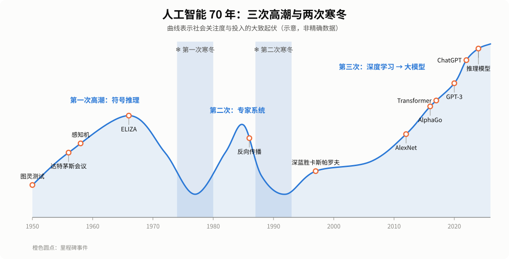
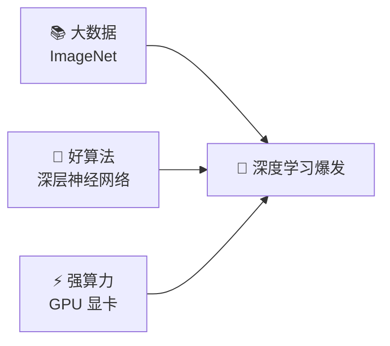

# 通用人工智能系列（二）：七十年风雨路——AGI 的发展历史

> [← 上一篇：什么是通用人工智能？](01-what-is-agi.md) ｜ [系列目录](README.md) ｜ [下一篇：大模型时代的 AGI 现状 →](03-present.md)

---

“让机器像人一样思考”，这个梦想几乎和计算机一样古老。七十多年来，人工智能经历了**三次高潮、两次寒冬**，每一次都有人宣布“通用智能就在眼前”，每一次又都发现路比想象的长。

先看一张全景图：

  

下面我们按时间顺序，分五个阶段来讲。

---

## 第一阶段：梦想启航（1950—1973）

### 图灵的提问

1950 年，英国数学家**艾伦·图灵**发表了论文《计算机器与智能》。开篇第一句就是：

> “我建议大家思考这样一个问题：机器能思考吗？”

他提出了后来被称为“**图灵测试**”的想法：如果一台机器能在文字对话中让人分辨不出它是机器，我们就可以说它拥有智能。这是人类第一次认真地、可操作地讨论“机器智能”。

### 达特茅斯会议：AI 诞生了

1956 年夏天，约翰·麦卡锡、马文·明斯基、克劳德·香农等一批年轻科学家聚集在美国达特茅斯学院，开了一场为期约两个月的研讨会。正是在这次会议的提案中，“**人工智能**（Artificial Intelligence）”这个词被正式提出。**1956 年因此被称为“AI 元年”。**

他们在提案里乐观地写道：学习和智能的每一个方面，原则上都可以被精确描述，从而让机器去模拟。

### 早期的“神奇”成果

接下来十几年，AI 研究捷报频传：

- **逻辑理论家**（1956）：能自动证明数学定理的程序。
- **感知机**（1958）：心理学家罗森布拉特发明的最早的“人工神经元”，能学会识别简单图形——这是今天深度学习的老祖宗。
- **ELIZA**（1966）：麻省理工学院的魏泽鲍姆写出的聊天程序，模仿心理医生和人对话。它其实只是在做简单的关键词替换，却让很多人以为它真的“懂”自己。

当时的顶尖学者们非常乐观。有人预言“二十年内，机器将能做人能做的任何工作”。**这可以说是人类第一次对 AGI 的集体憧憬。**

### 💡 这一阶段的思路：符号主义

早期 AI 的主流思路叫“**符号主义**”：把知识写成一条条规则和符号（比如“如果 A 那么 B”），让计算机做逻辑推理。就像给机器编一本巨大的“说明书”。

---

## 第二阶段：第一次寒冬（1974—1980）

好景不长。研究者很快发现：

1. **算力太弱**：当时计算机的内存和速度，连今天一块电子手表都不如。
2. **组合爆炸**：现实问题的可能情况多到天文数字，靠穷举和规则根本算不过来。
3. **常识难题**：人类“不言自明”的常识多得数不清，根本写不完。
4. **感知机的局限**：1969 年，明斯基和派珀特在《感知机》一书中指出，单层感知机连“异或”这样简单的问题都解决不了，神经网络研究因此陷入低潮。

1973 年，英国的《莱特希尔报告》严厉批评 AI 研究“没有兑现承诺”，英美政府随后大幅削减经费。AI 进入了**第一次寒冬**。

> 📌 教训：**低估了“常识”和“现实世界”的复杂度。**

---

## 第三阶段：专家系统的繁荣与第二次寒冬（1980—1993）

### 专家系统热

1980 年代，AI 换了一个更务实的方向：**不求通用，只求专精**。

“**专家系统**”把某个领域专家的经验写成成百上千条规则，比如“如果病人发烧且白细胞升高，那么可能是细菌感染”。美国 DEC 公司用专家系统 XCON 帮助配置计算机订单，据称每年节省数千万美元。

一时间，企业纷纷投资，日本在 1982 年启动了雄心勃勃的“**第五代计算机**”计划，想造出能推理、能对话的智能计算机。AI 迎来了**第二次高潮**。

### 神经网络的暗流

与此同时，另一条路线在悄悄积蓄力量。1986 年，鲁梅尔哈特、**辛顿**和威廉姆斯发表论文，推广了“**反向传播**”算法——一种让多层神经网络自己从错误中学习、调整参数的方法。它解决了感知机“学不会复杂问题”的难题，为日后的深度学习打下了地基。

### 第二次寒冬

然而专家系统的问题很快暴露：

- 规则越写越多，**维护成本极高**，而且规则之间经常互相矛盾；
- 遇到规则没覆盖的情况，系统就**束手无策**，非常“脆”；
- 专用的 AI 计算机（LISP 机）市场在 1987 年前后崩溃，第五代计算机计划也没有达到预期目标。

资金再次撤离，AI 进入**第二次寒冬**。很多研究者甚至不愿说自己在做“人工智能”，而改称“机器学习”“模式识别”。

> 📌 教训：**靠人手写规则，无法通向通用智能。机器必须学会自己学习。**

---

## 第四阶段：机器学习与深度学习崛起（1993—2017）

### 从“写规则”到“学数据”

1990 年代起，研究重心转向**统计机器学习**：不再手写规则，而是给机器大量例子，让它自己总结规律。随着互联网兴起，数据越来越多，这条路越走越宽。

- **1997 年**：IBM 的“**深蓝**”击败国际象棋世界冠军卡斯帕罗夫，轰动世界。不过深蓝主要靠强大的算力做搜索，依然是典型的“专用 AI”。
- **1998 年**：杨立昆（Yann LeCun）的卷积神经网络 LeNet 被用于识别支票上的手写数字。
- **2006 年**：辛顿等人提出“深度信念网络”的训练方法，“**深度学习**”一词开始流行。
- **2009 年**：李飞飞团队发布了包含上千万张标注图片的 **ImageNet** 数据集。

### 2012：深度学习的“大爆炸”

2012 年，辛顿和学生开发的 **AlexNet** 在 ImageNet 图像识别比赛中，把错误率从约 26% 一下降到约 15%，远远甩开对手。它的秘诀是三样东西的结合：

**数据、算法、算力**——这三驾马车从此成为 AI 发展的核心动力。此后几年，语音识别、机器翻译、人脸识别的准确率突飞猛进，AI 迎来**第三次高潮**。

### AlphaGo：机器会“直觉”了吗？

2016 年 3 月，DeepMind 的 **AlphaGo** 以 4:1 战胜围棋世界冠军李世石。围棋的可能局面数量比宇宙中的原子还多，无法靠穷举取胜，AlphaGo 靠的是深度神经网络形成的“棋感”加上自我对弈的强化学习。

2017 年，它的升级版 **AlphaZero** 更进一步：**不看任何人类棋谱**，只知道规则，靠自己和自己下棋，几小时内就在围棋、国际象棋和日本将棋上都达到了超越人类的水平。

这让人们第一次看到：**同一套学习方法，可以掌握多种不同的任务**——虽然还只是棋类，但已经闪现出“通用”的影子。

---

## 第五阶段：Transformer 与大模型（2017—2022）

### 一篇改变一切的论文

2017 年，Google 的研究者发表了论文《**Attention Is All You Need**》（注意力就是你所需要的一切），提出了 **Transformer** 架构。

它的核心是“**注意力机制**”：读一句话时，模型能同时关注句中所有的词，并判断哪些词之间关系更密切。比如读到“它”时，能自动找到“它”指的是前面哪个名词。Transformer 训练效率高、特别适合在大量 GPU 上并行计算，**几乎成了此后所有大模型的共同骨架**。

### 从 GPT 到 ChatGPT

OpenAI 基于 Transformer 开发了 **GPT 系列**（生成式预训练 Transformer）：

| 年份 | 模型 | 参数量 | 意义 |
|---|---|---|---|
| 2018 | GPT-1 | 约 1.17 亿 | 证明“先在海量文本上预训练，再微调”行得通 |
| 2019 | GPT-2 | 约 15 亿 | 能写出连贯的长文，一度因担心被滥用而推迟完整发布 |
| 2020 | GPT-3 | 约 1750 亿 | 不用专门训练，只要给几个例子就能做新任务（“少样本学习”） |
| 2022 | ChatGPT | — | 通过人类反馈强化学习（RLHF）学会了好好对话，引爆全球 |

同一时期，研究者发现了“**规模定律**”（Scaling Laws）：模型越大、数据越多、算力越强，模型的表现就会**可预测地**变好。更神奇的是，当规模大到一定程度，模型会突然“涌现”出一些小模型没有的能力，比如多步推理、写代码。

2022 年 11 月 30 日，**ChatGPT** 上线。它只用了大约两个月，月活跃用户就突破一亿，成为当时历史上增长最快的消费级应用。**AGI 第一次从科幻小说和学术论文，走进了普通人的日常生活。**

### 同时期的其他重要进展

- **AlphaFold 2**（2020）：几乎解决了困扰生物学界 50 年的“蛋白质结构预测”难题。
- **扩散模型**（2022）：DALL·E 2、Midjourney、Stable Diffusion 让 AI 画画成为现实。
- **中国的探索**：2017 年国务院发布《新一代人工智能发展规划》；此后百度、阿里、智谱、华为等机构陆续推出自己的大模型。

---

## 回顾：七十年，我们学到了什么？

| 时期 | 主流思路 | 取得的成就 | 碰到的墙 |
|---|---|---|---|
| 1950s—70s | 符号推理：把智能写成逻辑规则 | 定理证明、简单对话 | 常识写不完、组合爆炸 |
| 1980s | 专家系统：把专家经验写成规则 | 在窄领域有商业价值 | 规则脆弱、难以维护 |
| 1990s—2010s | 机器学习：让机器从数据中学 | 图像、语音识别突破 | 一个模型只会一件事 |
| 2017— | 大模型：用海量数据训练通用模型 | 一个模型能做成百上千种任务 | 仍在探索中（见下一篇） |

一条清晰的主线是：**从“人教机器规则”，走向“机器自己从数据中学习”；从“一个模型做一件事”，走向“一个模型做很多事”。** 这正是通向“通用”的方向。

另一个教训是：**每一次热潮中，人们都容易高估短期进展、低估长期难度。** 用历史的眼光看今天的 AI 热，既要看到真实的突破，也要保持一份冷静。

下一篇，我们来看看：站在 2026 年，AGI 走到了哪一步？

👉 [通用人工智能系列（三）：大模型时代——AGI 的现状](03-present.md)
