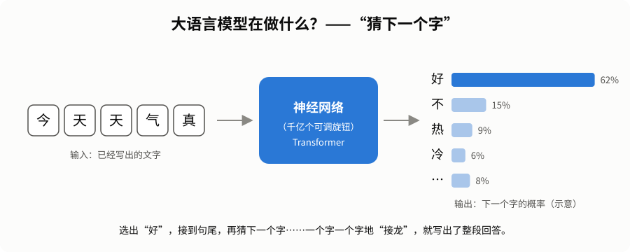
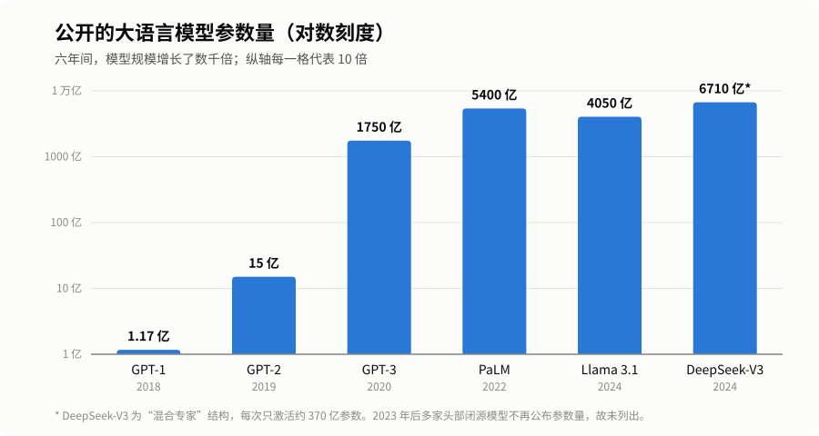
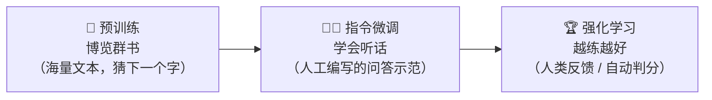
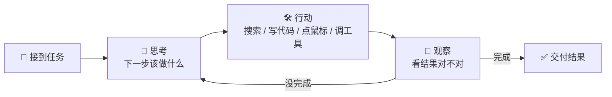
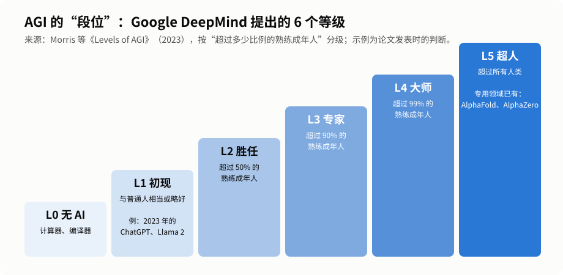
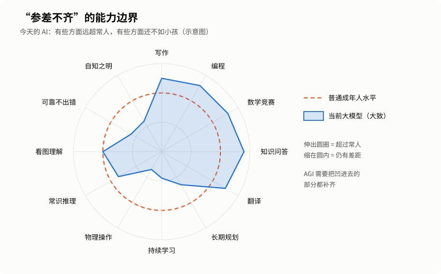

# 通用人工智能系列（三）：大模型时代——AGI 的现状

> [← 上一篇：七十年风雨路](02-history.md) ｜ [系列目录](README.md) ｜ [下一篇：AGI 的未来 →](04-future.md)

---

ChatGPT 问世之后，AI 的发展速度快得让人眼花缭乱。本篇试着回答三个问题：

1. 这几年到底发生了什么？
2. 大模型是怎么“变聪明”的？
3. 今天的 AI 离 AGI 还有多远？

> ⚠️ 本文写于 2026 年 9 月。这个领域变化极快，文中的具体产品和数字可能很快过时，但背后的思路和趋势相对稳定。

---

## 一、2023—2026：狂飙的四年

### 2023：“百模大战”

- **GPT-4** 发布：能看懂图片，在美国律师资格考试等多项专业考试中达到人类考生的较高水平。
- **Claude、Gemini** 等模型相继推出，形成多强竞争格局。
- Meta 开放了 **Llama** 系列模型的权重，任何人都能下载、研究、改造，**开源大模型**生态迅速壮大。
- 国内出现“百模大战”：文心一言、通义千问、智谱 GLM、Kimi 等纷纷登场。

### 2024：多模态与“会思考”的模型

- **多模态**全面开花：AI 能实时语音对话、看视频、生成逼真的视频片段。
- **推理模型**出现：OpenAI 的 o1 系列会在回答前先“打草稿”，把问题拆成很多小步骤慢慢想。在数学、编程竞赛题上的成绩大幅提升。
- **诺贝尔奖**首次大规模“拥抱”AI：物理学奖授予神经网络先驱**霍普菲尔德**和**辛顿**；化学奖的一半授予 AlphaFold 的开发者**哈萨比斯**和**江珀**。

### 2025：开源追赶、智能体元年

- 年初，**DeepSeek-R1** 发布：一个开源的推理模型，以相对低得多的训练成本达到了与顶尖闭源模型接近的水平，震动了全球科技界和资本市场，也证明了“**不一定非要堆最多的钱，聪明的方法同样重要**”。
- **AI 智能体（Agent）** 成为主角：AI 不再只是回答问题，而是能自己操作电脑、写代码、查资料、调用工具，连续工作数十分钟甚至几个小时完成一项任务。
- **数学能力突破**：在 2025 年国际数学奥林匹克（IMO）上，多家机构的实验性 AI 模型用自然语言写出证明，达到了**金牌水平**。
- **具身智能升温**：人形机器人登上春晚舞台扭秧歌；能生成可交互 3D 世界的“世界模型”也开始出现。

### 2026：从“能聊”到“能干”

到今天，前沿模型已经能够：

- 独立完成许多需要人类专业人员花**数小时**的软件工程任务；
- 阅读和分析几十万字的长文档；
- 同时处理文字、图片、语音、视频；
- 作为“AI 同事”参与科研、编程、办公等真实工作流程。

一项来自研究机构 METR 的测量发现：**AI 能独立完成的任务长度（以人类专家完成所需时间计算），大约每 7 个月翻一番。** 如果这个趋势延续，AI 能自主完成的工作将从“几分钟的小任务”迅速扩展到“几天、几周的大项目”。

---

## 二、大模型是怎么“变聪明”的？

### 1. 核心原理：猜下一个字

大语言模型的基本功非常朴素——**根据前文，猜下一个字**。

  

听起来很简单，但想要**猜得准**，模型就必须“理解”很多东西：

- 要续写“水在 100 度时会……”，得懂物理常识；
- 要续写一段侦探小说的结尾，得理解人物关系和推理过程；
- 要续写一段代码，得懂编程逻辑。

当模型在**几乎整个互联网规模的文本**上反复练习“猜下一个字”，它就被迫把语言、知识、逻辑都压缩进了自己的参数里。有人把这比喻为：**“为了把接龙玩到极致，它不得不学会了世界。”**

### 2. 越来越大的“大脑”

  

参数可以理解为神经网络里的“可调旋钮”。从 GPT-1 到今天，公开模型的参数量增长了几千倍，训练所用的数据和算力增长得更多。这就是“**规模定律**”的力量：只要持续加大规模，性能就会稳定提升。

### 3. 训练的三个阶段

把一个大模型“培养成才”，大致像培养一个学生：

1. **预训练**：读遍海量书籍、网页、代码，积累知识——相当于“上学读书”。
2. **指令微调**：用人工写好的“问题—好答案”示范，教它如何按要求回答——相当于“岗前培训”。
3. **强化学习**：让它不断尝试，做得好就奖励、做得不好就惩罚。早期主要靠人类打分（RLHF）；到了推理模型时代，对于数学、编程这类**答案可以自动验证**的问题，模型可以自己反复练习上百万道题，推理能力因此大幅提升。

### 4. 从“快思考”到“慢思考”

心理学家丹尼尔·卡尼曼把人的思维分成两种：

- **系统 1（快思考）**：凭直觉脱口而出，比如“2+2=4”；
- **系统 2（慢思考）**：需要一步步推演，比如“37×48=？”

早期的聊天模型更像“系统 1”，张口就答，因此常在复杂问题上出错。**推理模型**学会了先在“草稿纸”上写下长长的思考过程，检查、回退、换思路，然后再给出答案——更接近“系统 2”。实践证明：**让模型多想一会儿（花更多计算），答案就会明显更好**，这被称为“**推理时扩展**”（test-time scaling）。

### 5. 从“聊天机器人”到“智能体”

光会说还不够，AGI 还需要会“做”。智能体给大模型接上了“手和眼”：

一个编程智能体，可以自己阅读代码库、修改文件、运行测试、发现报错再修复，直到任务完成。为了让 AI 方便地连接各种工具和数据，业界还出现了统一的“接口标准”（例如 MCP 模型上下文协议），就像给 AI 配了一个万能插座。

---

## 三、离 AGI 还有多远？

### 1. 给 AGI 定“段位”

2023 年，Google DeepMind 的研究者提出了一个分级框架，按“**超过多少比例的熟练成年人**”来给 AI 定级：

  

在他们看来，AI 可以在**专用**领域先达到很高段位（比如 AlphaFold 在蛋白质结构预测上已是“超人级”），而**通用**能力要一级一级往上爬。当时的聊天机器人被评为 L1“初现级通用 AI”。

OpenAI 也曾在内部提出过一个五级路线：**聊天者 → 推理者 → 智能体 → 创新者 → 组织者**。按这个说法，今天的前沿 AI 大致处在从“推理者”走向“智能体”的阶段。

### 2. “参差不齐”的能力边界

今天 AI 最大的特点，是**能力极不均匀**：

  

它可以解出奥赛难题、几秒写出一个网页，却可能在数清一个单词里有几个字母、判断一张图里钟表的时间这类“幼儿园题目”上出错。研究者把这种现象称为“**锯齿状的能力边界**”（jagged frontier）。

### 3. 仍待攻克的几座大山

| 短板 | 通俗解释 |
|---|---|
| **幻觉** | 有时会一本正经地编造事实、引用不存在的文献，而且自己意识不到 |
| **持续学习** | 训练完就“定型”了，不能像人一样边工作边积累经验；每次对话结束，学到的东西大多会“忘掉” |
| **长期规划与可靠性** | 任务链条一长，一步小错就可能导致全盘失败 |
| **物理世界** | 对重力、摩擦、空间关系等的理解仍然有限，机器人灵巧操作还很初级 |
| **学习效率** | 人类孩子听几次就能学会一个新词，模型却需要海量数据 |
| **能耗与成本** | 训练一个前沿模型需要巨大的算力和电力，人脑却只需约 20 瓦 |
| **可解释与可控** | 我们还不能完全看懂模型内部在“想”什么，也难以保证它总按人类意图行事 |

### 4. 专家们怎么看？

对于“AGI 何时到来”，业内的看法差异很大：

- **乐观派**：一些 AI 公司的领导者认为，按当前速度，**几年之内**就可能出现在多数认知任务上达到甚至超过人类专家水平的系统。
- **中间派**：如 DeepMind 的哈萨比斯多次表示，AGI 可能在**未来五到十年**出现，但仍需要一两个关键突破。
- **谨慎派**：如图灵奖得主杨立昆认为，仅靠大语言模型无法达到人类水平智能，AI 必须学会理解物理世界、建立“**世界模型**”，这需要新的架构。

另外，“AGI”本身定义就不统一——有人看重“能否完成大部分脑力工作”，有人看重“能否像人一样高效学习”。**定义不同，答案自然不同。**

---

## 四、小结

- 2023—2026 年，AI 从“**会聊天**”快速走向“**会推理**”“**会干活**”。
- 大模型的成功秘诀是：**Transformer 架构 + 海量数据 + 巨大算力 + 强化学习**。
- 今天的 AI 已经在很多智力任务上超过普通人，但能力参差不齐，在**可靠性、持续学习、物理世界理解**等方面仍有明显短板。
- 我们大概正站在 AGI 的**门槛附近**——但门后还有多远，没有人能确切知道。

最后一篇，我们将展望未来：通往 AGI 有哪些路？会带来什么？我们又该做些什么？

👉 [通用人工智能系列（四）：AGI 的未来——路线、挑战与希望](04-future.md)
