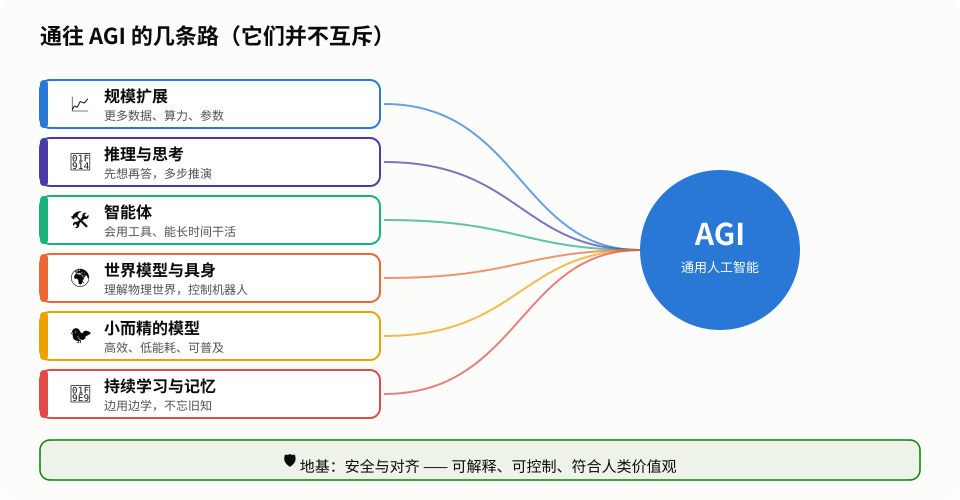

# 通用人工智能系列（四）：AGI 的未来——路线、挑战与希望

> [← 上一篇：大模型时代的 AGI 现状](03-present.md) ｜ [系列目录](README.md)

---

前三篇我们讲了 AGI 是什么、从哪里来、走到了哪里。这一篇，我们一起往前看：**通往 AGI 还有哪些路？它会给世界带来什么？我们应该如何准备？**

> 预测未来是一件风险很高的事。本文不做“某年某月实现 AGI”的断言，而是梳理目前主要的技术方向和社会议题，帮助大家形成自己的判断。

---

## 一、通往 AGI 的几条路

  

这些路线**并不互斥**，更可能的情况是：未来的 AGI 会把它们组合在一起。

### 📈 路线一：继续扩大规模

**思路**：更多数据、更大模型、更强算力，让“规模定律”继续发挥作用。

**挑战**：

- **数据墙**：互联网上高质量的人类文本快被“读完了”。解决办法包括用 AI 生成的**合成数据**、从视频和真实世界交互中学习等。
- **算力与能源**：训练前沿模型需要数十万块芯片和堪比一座小城市的电力，成本高昂，也带来环境压力。

### 🤔 路线二：让模型更会“思考”

**思路**：不只是把模型做大，而是让它**在回答前想得更久、想得更好**。通过强化学习，模型可以在数学、编程等能自动检验对错的领域不断自我提升。

**展望**：未来的 AI 可能会像科学家一样，提出假设、设计实验、验证结论，甚至**发现人类尚未发现的知识**——这被一些人视为 AGI 的重要标志。

### 🛠 路线三：智能体——从“顾问”到“员工”

**思路**：让 AI 能使用工具、操作电脑、与其他 AI 协作，**长时间自主完成复杂任务**。

**展望**：未来你可能只需要说一句“帮我策划一场 50 人的公司团建”，AI 就会自己比价、订场地、发通知、做预算。一个人带着一群 AI 智能体，就能完成过去一个团队的工作。

**关键难点**：长任务中的**可靠性**——如果每一步有 1% 的出错率，一百步之后成功率就只剩三分之一左右了。

### 🌍 路线四：世界模型与具身智能

**思路**：人类的智能不只来自读书，更来自**与物理世界的互动**。婴儿通过抓、扔、摔东西，学会了重力和因果。AI 也需要：

- **世界模型**：在“脑中”模拟世界如何运转，能预测“如果我这样做，会发生什么”；
- **具身智能**：拥有身体（机器人），在真实或虚拟环境中感知、行动、学习。

**展望**：家务机器人、自动驾驶、工厂里的灵巧机械手……当 AI 真正理解物理世界，它的能力将从屏幕延伸到现实。这也是破解“莫拉维克悖论”的关键。

### 🐦 路线五：小而精——高效的智能

**思路**：人脑只有约 20 瓦功率，却能完成今天超级计算机都做不好的事。**智能的关键或许不在于规模，而在于结构和效率。**

主要技术包括：

- **知识蒸馏**：让“大模型老师”把本领教给“小模型学生”；
- **混合专家（MoE）**：模型很大，但每次只调用其中一小部分“专家”，又快又省；
- **更好的架构与数据**：用更精心挑选的数据、更聪明的结构，让小模型也有大本事。

**展望**：未来强大的 AI 可以在手机、汽车、机器人本地运行，不依赖云端，更省电、更保护隐私，也让更多人、更多地区能用得起。

### 🧩 路线六：持续学习与长期记忆

**思路**：今天的模型训练完就“定型”了。真正的通用智能应该像人一样，**在使用中不断学习**，积累经验，同时不忘记旧知识（避免所谓的“灾难性遗忘”）。

**展望**：一个能持续学习的 AI 助手，会越用越懂你、越用越能干，就像一位跟你共事多年的老同事。

### 🛡 地基：安全与对齐

无论走哪条路，都必须建在一个坚实的地基上——**让 AI 的目标和行为与人类的价值观保持一致**，这被称为“**对齐**”（Alignment）。相关研究包括：

- **可解释性**：打开 AI 的“黑箱”，看懂它内部是怎么想的；
- **可控性**：确保人类能随时监督、纠正、叫停 AI；
- **评估与测试**：在发布前系统地检查 AI 是否有危险能力或不良倾向。

---

## 二、AGI 可能带来的改变

如果 AGI 真的到来，它可能是人类历史上影响最深远的技术之一。

### 🌟 美好的一面

- **加速科学发现**：AlphaFold 已经预测了两亿多种蛋白质结构，被全世界的科学家使用。未来的 AI 科学家可能帮助我们攻克癌症、阿尔茨海默病，找到新材料、新能源。
- **人人都有好老师、好医生**：每个孩子都可以有一位耐心的一对一家教；偏远地区的人也能获得高水平的医疗咨询。
- **生产力大幅提升**：大量重复性的脑力劳动交给 AI，人们可以把时间用在更有创造性、更有意义的事情上。
- **帮助应对全球挑战**：气候建模、能源优化、灾害预警、粮食育种……

### ⚠️ 需要警惕的一面

| 风险 | 说明 |
|---|---|
| **就业冲击** | 许多工作岗位会被改变甚至取代，社会需要帮助人们转型、学习新技能 |
| **虚假信息** | 以假乱真的文字、图片、视频、声音，可能被用于诈骗和操纵舆论 |
| **滥用** | 被用于网络攻击、制造危险物品等恶意目的 |
| **权力集中** | 如果只有少数公司或国家掌握最强的 AI，可能加剧不平等 |
| **失控** | 更长远地看，如果 AI 的能力远超人类而目标又与人类不一致，后果可能非常严重 |
| **过度依赖** | 人们可能丧失独立思考和基本技能 |

### 🌐 全世界都在行动

- **2023 年**：中国发布《生成式人工智能服务管理暂行办法》；首届全球人工智能安全峰会在英国布莱切利园举行，包括中美在内的多个国家签署了《布莱切利宣言》。
- **2024 年**：欧盟《人工智能法》正式生效，按风险等级对 AI 进行分类管理。
- 多国成立了专门的 AI 安全研究机构，主要 AI 公司也发布了各自的安全框架与承诺。

AI 治理的核心难题是：**既要防范风险，又不能扼杀创新；既要各国自主，又需要全球合作。**

---

## 三、普通人该如何面对 AGI？

1. **保持好奇，动手去用**：AI 工具是新时代的“计算器”和“搜索引擎”。越早熟悉它的长处和短板，越能从中受益。
2. **保持批判性思维**：AI 会犯错、会“幻觉”。重要的信息一定要多方核实。
3. **培养 AI 难以替代的能力**：提出好问题的能力、判断力、创造力、同理心、与人协作的能力，以及在真实世界中动手解决问题的能力。
4. **终身学习**：技术变化越快，“学会学习”就越重要。
5. **参与讨论**：AGI 的未来不只是科学家和企业的事，它关乎每个人。了解它、讨论它、表达你的看法。

---

## 四、SMART 项目的思考：麻雀虽小，五脏俱全

在本仓库的 [SMART 项目介绍](../profile/README_CN.md) 中，我们提出了一个与“越大越好”不同的设想：

> **真正的智能不在于规模大小，而在于智慧设计。**

回顾全系列，我们认为这个方向与 AGI 的发展趋势是契合的：

| SMART 理念 | 对应的 AGI 挑战 |
|---|---|
| **Small 小型化**：参数少于 10 亿的轻量化设计 | 能耗与成本、普及与公平（路线五） |
| **Multitalented 多才多艺**：跨模态统一视觉、语言、听觉、符号推理 | 通用性与知识迁移（第一篇） |
| **Artistic 艺术性**：基于审美原理而不只是模式复制的创造力 | 真正的创新，而非简单模仿 |
| **Realistic 现实性**：基于物理规律的学习与具身训练 | 世界模型与具身智能（路线四） |
| **Trusting 可信性**：内建的自解释与伦理约束 | 安全、对齐与可解释性（地基） |

人脑用 20 瓦的功率就实现了通用智能，这本身就证明了：**“小而全”的通用智能，在原理上是可能的。** 我们欢迎更多的开发者、研究者和创作者加入，一起探索这条路。

---

## 结语

从 1950 年图灵的提问，到今天能写代码、解奥赛题、操作电脑的 AI，人类用了七十多年。

这条路上有过狂热，也有过寒冬；有过被高估的承诺，也有过被低估的突破。今天，我们可能比历史上任何时候都更接近通用人工智能——但**它最终会成为什么样子，取决于我们今天的选择。**

正如图灵在那篇论文的结尾所写：

> “我们只能看到前方很短的距离，但我们能看到，那里有许多事情需要去做。”

---

👉 回到 [系列目录](README.md)
