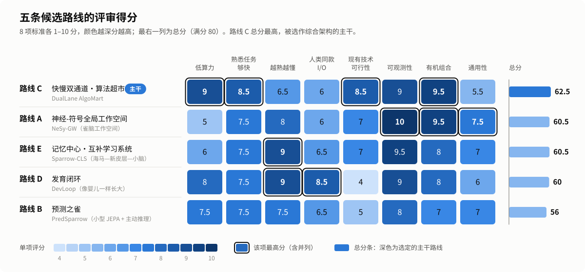
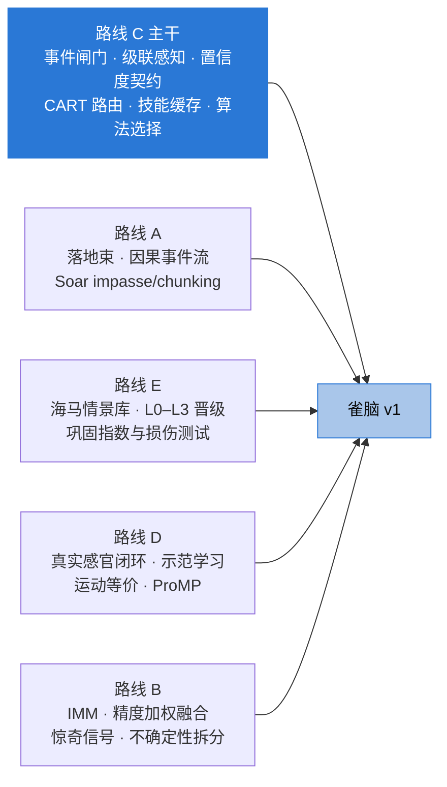

# 雀脑设计（一）：五条候选路线与评审

> 本系列介绍 SMART-Sparrow（雀脑）v1 的设计。这是第一篇：动手画架构之前，我们先比较了五条完全不同的路线，逐条核查，再打分取舍。
>
> [设计文档目录](README.md) ｜ 下一篇：[雀脑 v1 综合架构 →](02-sparrow-architecture.md)

---

## 一、为什么要先比较五条路线

“小而全的通用智能”没有标准答案。同样是不到 10 亿参数、只用眼睛和耳朵学习，可以把重心放在**符号推理**上，也可以放在**预测世界**上，还可以放在**记忆**或**像婴儿一样发育**上。只沿一条思路往下做，很容易把它的盲点一起继承下来。

所以我们的做法是：

核查的总体结论是：五份方案点名的模型、论文和开源项目**几乎都真实存在，没有发现虚构组件**。问题主要集中在三类：

1. **数字偏乐观**：最常见的是把 MACs（乘加次数）当成 FLOPs（浮点运算次数，约为 MACs 的 2 倍），以及忽略语音“端点检测”要等多久才能确认一句话说完。
2. **结构化知识的“走私”**：字形库、知识图谱、语法规则直接装进系统，没有经过“看”或“听”，却没有公开说明。
3. **自己验证自己**：用自己的识别器检查自己的输出，或者绕过摄像头、麦克风直接读内部数据，形成循环验证。

## 二、评分维度

每条路线按 8 个维度各打 0–10 分，满分 80：

| 维度 | 含义 |
|---|---|
| 低算力 | 参数量、常驻负载、能否在笔记本或 Jetson 上实时运行 |
| 熟悉任务速度 | 熟练之后，从听清指令到开始动作要多久 |
| 越熟越懂的深度 | 熟练不只是“更快”，还要“更准、更懂”，而且有结构上的载体 |
| I/O 忠实度 | 是否真的只靠原始视听输入、只经三路输出，有没有暗中注入结构化知识 |
| 现有技术可行性 | 用今天的开源组件、在合理时间内能不能做出来 |
| 可观测性 | 能不能看清它在想什么、学到了什么、怎么学会的 |
| 有机组合 | 是否把每种算法用在它最擅长的地方 |
| 通用性 | 面对设计者没预料到的新任务，还能不能应付 |

## 三、五条路线逐一看

### 路线 A：神经-符号全局工作空间（NeSy-GW，“雀脑工作空间”）

**一句话**：一个“意识舞台”加一群便宜的专家。小网络把视听信号变成带证据链的符号，再由规则系统、知识图谱和可执行的“生成程序”去写、画、说。

**核心思想**

- **许多便宜的专家，一个容量极小的舞台。** 大量“无意识”的专家并行处理像素和波形，有小神经网络（DINOv2-S、MobileSAM、流式 ASR），也有经典算法（光流、卡尔曼、DTW、随机森林）。它们只把“结论”投递到全局工作空间（Baars 的全局工作空间理论、Hearsay-II 黑板）。仲裁器每约 100ms 选出不超过 4 个内容广播给全体模块。**注意力就是算力调度**：重模型只在焦点需要时才被唤起。
- **双向落地。** 每个概念挂一个“落地束”（grounding bundle）：多模态样例、判别用的分类器，以及一个可执行的生成程序（字的笔画程序、物体的草图程序、词的发音串）。识别时用它，写、画、说时也执行它。所以“认识”“会写”“会画”“会说”是同一个表示的不同读出。
- **三条通道 + 编译 + 巩固。** 反射通道几十毫秒，规则推理约 100ms，深思通道秒级。深思成功后由 Soar chunking 编译成新规则，熟悉任务自然滑向快通道；睡眠中再做抽象和蒸馏。

**主要模块**（17 个）：视觉前端（中央凹 + 物体文件）、听觉前端、符号落地层、快慢双通道语言理解、全局工作空间与注意仲裁、元认知路由器、程序性记忆、语义记忆（知识图谱）、情景记忆、推理与规划工具箱、程序归纳与库学习、直觉物理、书写运动控制、视觉生成（按需 DiT）、语音生成、睡眠巩固、认知遥测与上帝视角平台。

**亮点**：可观测性是五条中最好的，工作空间里每个条目都带证据链和因果父 ID；落地束让三路输出一致、互相验证；约 100 条引用都真实存在。

**核查发现的问题**

- **参数**：PP-OCRv4 把文件 MB 当成了参数量（实际约 3.8M，而且应换 v5 以支持手写）；RBT3 是 38M 而不是 15M；备选的 MeloTTS 中文依赖 167–326M 的 BERT，SenseVoice-Small 是 234M 且非流式；另漏算了 LaMa、BTTR/CoMER。修正后总量约 **0.86–0.95B**，余量很小，任选一个备选就会超过 1B。
- **算力**：MobileSAM 每次约 39 GMACs 被漏算，真实视觉负载是声称的 3–8 倍（日常约 0.2–0.9 TFLOPs/s，而不是 30–60 GFLOPs/s），纯 CPU 模式跑不动。
- **延迟**：150–300ms 的语音端点过于激进（sherpa-onnx 默认要等 1.2s）；熟悉任务端到端应为 0.5–0.9s，S4 为 0.6–1.5s。
- **约束**：直接导入 Make Me a Hanzi 字形库和 ConceptNet；语音识别和文字识别共用 Unicode 标签这座“符号桥”没有披露；反事实沙盒可以把编辑写回运行中的系统。
- **其它**：用 DiT 按概念条件一次性生成新视角不可信；缺少物体提议、社会反馈感知、书写完成判定三个模块。

### 路线 B：预测之雀 PredSparrow（小型 JEPA 世界模型 + 主动推理）

**一句话**：约 3 亿参数的世界模型不停地预测“下一刻会看到、听到什么”；写、说、画都是“让预测成真”的动作，由同一个规划器统一安排。

**核心思想**

- **智能 = 压缩预测 + 让预测成真。** 预测的是抽象表征，不是像素（JEPA）。感知是推断出让预测误差最小的状态；学习是降低长期预测误差，原始视听流本身就是免费的训练信号；行动采用主动推理：先设想期望的感知（“看到手写板上出现‘大’”），再搜索能让它发生的动作。
- **五个省算力杠杆**：只在潜空间预测、不生成像素；以物体为中心，多个“物体槽”共享一套动力学；卡尔曼、IMM、2D 物理引擎当强先验，网络只学残差；事件驱动，预测误差大时才重算；通过干预学因果，比如在屏幕上搭一个“物理沙盒”，用笔当鼠标摆斜坡、放小球。
- **快慢切换**：熟悉任务走习惯网络和技能缓存，陌生任务在潜空间里搜索动作；每次慢搜索的结果都蒸馏成习惯。

**主要模块**（16 个）：视觉前端、物体槽与跟踪、社交线索、带回声消除自听的听觉前端、言语理解、分层 JEPA 世界模型、混合物理、笔 / 发声 / 屏幕三个效应器、主动推理规划器、元控制、互补记忆、工作空间与符号引擎、睡眠巩固、内省总线。

**亮点**：物理直觉和预测是原生能力；三路输出统一成动作；集成方差让它知道自己什么时候没把握；用扬声器输出做参考的回声消除加自听支路，使它能边说边听。

**核查发现的问题**

- **算力严重低估**：16 步想象推演少算约 25 倍（约 8–10 GFLOPs，而不是 0.3）；常驻稳态实际约 60–180 GFLOPs/s；pymunk 粒子滤波实测要 0.2–1s（方案写 10–30ms）；DiffVG/CLIPDraw 式绘画实际要 10–60s（方案写 1–3s）。训练预算 25–40 GPU·天只是理想下界，更可能是 60–100。
- **走查断层**：16×16 的槽掩码测不准小球的位置和半径；碰撞前恢复系数无法辨识；pymdp 离散顶层和连续潜空间之间的接口是空白；小规模 JEPA 继续训练有表征坍缩的风险。
- **过度解读**：把注意力交互边称作“因果边”；集成方差既当好奇奖励又当风险惩罚，却没有调度规则；只靠“输入 + 随机种子”做不到确定性回放。
- **约束**：训练期直接用 Make Me a Hanzi 的笔顺拟合技能；200Hz 的笔闭环暗含一路来自手写板的本体感觉输入。

### 路线 C：快慢双通道·算法超市（DualLane AlgoMart）

**一句话**：小网络只当“感官皮层”，一棵浅决策树在毫秒内分发任务：快通道查表，慢通道调专家；慢通道每次成功的解，都当场编译进快通道。

**核心思想**

- **分工。** 原始像素和波形高维、连续、噪声大，这部分交给小型预训练编码器；压成嵌入、符号候选和几何结构之后，决策、记忆、推理、生成都交给成熟的经典算法：kNN、LightGBM、HMM/DTW/CRF、卡尔曼、规则引擎、SymPy、A*/MCTS/HTN、物理引擎。它们几乎不占参数，在 CPU 上微秒到毫秒级完成，而且可解释。
- **把“熟能生巧”写进架构。** 参照 Kahneman 的系统 1/系统 2、Logan 的实例理论（熟练就是“回忆”在与“计算”的竞速中胜出）和 Soar 的 chunking。每个请求归一化为任务键（意图, 槽位, 情境签名），快通道命中就直接做。
- **统一的置信度契约。** 每个专家都返回校准概率、共形集、新颖度、前两名间隔、预计代价。一棵深度不超过 6 的决策树据此输出四种动作之一：FAST / FAST+VERIFY / SLOW / ASK。慢通道内部为每个专家配一个“经验性能模型”预测成功率和耗时，按期望效用排序，另留少量探索。
- **五个省算力做法**：事件闸门、由廉到贵的级联早退、全层缓存、一次骨干多头复用、把训练和选型挪到睡眠期。

**主要模块**（19 个 + 可选兜底小语言模型）：事件闸门、视觉编码级联、视觉结构化专家、听觉前端、命令语义解析、黑板、技能缓存、路由器、算法选择器、识别与概念学习专家组、符号推理专家组、搜索规划与程序合成、物理世界模型、笔、屏幕、语音、记忆系统、睡眠巩固器、观测平台。

**亮点**：算力最低、工程上最稳；四动作路由是五条路线里最可审计的调度方案；“哪个算法放在哪里”的落位表写得最清楚。

**核查发现的问题**

- **参数**：PP-OCR mobile 的“10–15M”其实是文件大小（参数约 4M）；核心实际约 **0.11–0.15B**；兜底的 SmolLM2 基本不会中文，应换 Qwen2.5-0.5B，全系统约 0.6–0.75B。
- **延迟与存储**：200ms 端点过于激进，熟悉任务端到端实际约 350–800ms；S4 含书写完成判定约 0.4–0.7s；事件闸门常驻约占单核 10–15%（原写 <5%）；情景记忆若保留原始裁剪和音频，存储是 100–500GB 级，比原估大两个数量级。
- **走查断层**：冷门字“龘”不在字形库里，靠查表写出来是“魔法步骤”；用 Shape Context 拿描出的轮廓去比源掩码是同义反复；尺度和摩擦无法从同一个加速度中同时求出，pymunk 默认按圆盘算转动惯量、默认零摩擦；S4 静止 200ms 就触发，可能在题目写到一半时作答。
- **其它**：experta 已停止维护，不兼容 Python 3.10+；DreamCoder 一晚跑不完，应换 Stitch；共形预测在数据漂移下失去覆盖保证。
- **灰区**：预置的字形库、物理公式、事实表、句式模板和约 30 条路由规则，都没有经过“看”或“听”；观测平台的干预面板是一条结构化输入通道，必须与学习数据隔离。

### 路线 D：发育闭环（DevLoop）：像婴儿一样长大的具身小脑

**一句话**：一开始只有冻结的先天感知和两副低维“身体”（笔和嗓子）；输出会被自己的眼睛和耳朵重新感知，在好奇心驱动的课程里，从咿呀学语、乱涂乱画长成会说、会写、会画、会算。

**核心思想**

- **先天骨架 + 后天发育。** 先天部分是冻结的预训练编码器、Spelke 式核心知识（物体恒存、连续性、1–4 的小数感）、几种反射、两副身体和一套学习机器；其余都靠感知—动作闭环、模仿和社交互动学到。
- **人类同款 I/O 本身就是训练信号的发动机。** 每次涂鸦、每次发声都产生一条“指令→感知结果”的样本；写完能读一遍，说完能听一遍；人的示范和自己的作品用同一双眼睛测量。
- **发育课程。** 身体发现 → 目标式咿呀学语 → 联合注意与模仿 → 词汇爆发 → 符号与书写 → 组合与推理。大部分时间在“虚拟育儿室”里以 10–100 倍实时的速度运行。
- **四级提速阶梯**：搜索（秒级）→ 检索（约 100ms）→ 摊销网络（10–50ms）→ 编译规则加缓存程序（毫秒级）。

**主要模块**（18 个）：视觉前端、物体槽、社会感知与联合注意、听觉前端与自听回路、口语词发现、身体图式、笔迹运动系统、发声运动系统、画布、好奇心与课程引擎、概念中枢、工作空间与产生式系统、快慢仲裁、世界模型、数与符号、海马情景记忆、睡眠巩固、观测台。

**亮点**：人类同款 I/O 做得最忠实；运动程序以视觉坐标存储（运动等价），ProMP 分布刻画“哪些变化无关紧要”，让“越熟越懂”在认知上最有深度；能用前向模型把计划渲染成“脑内草图”和“内心独白”，这是独有的观测手段；参数只有 0.16–0.23B。

**核查发现的问题**

- **可行性**：从咿呀学出可懂、带声调的普通话，以及无监督切分中文口语词，都还是开放研究问题。“6 个月 MVP”不现实，应按 9–12 个月规划；sim-to-real 只按“几小时”计也被低估。
- **分辨率**：640×480 广角摄像头下，一个 3cm 高的汉字只有约 15 像素，读不了手写字和白板。
- **算力**：感知负载低估 2–4 倍（FLOPs/MACs 混用；HuBERT 用 1s 窗、160ms 步长时同一段音频要算 6.25 遍），修正后约 80–150 GFLOPs/s；熟悉任务延迟 GPU 约 0.35–0.6s、CPU 约 0.6–1.0s。
- **说法过强**：成人与孩童声道之间仍有声学对应问题，“模仿没有对应问题”不成立；用自己的产出训练识别器再验证自己，是循环验证。
- **约束**：用外部 ASR 做发育阶段门控，等于文本监督进入了学习回路；上声变调、数词文法、表达式文法等规则其实是注入的。
- **漏计**：读回需要的小型手写汉字识别器（2–5M）和线稿网络（约 10M），补齐后约 0.18–0.6B，仍低于 1B。

### 路线 E：记忆中心：海马—新皮层—小脑互补学习系统（Sparrow-CLS）

**一句话**：把“计算”逐步换成“回忆”。每段经历先一次性写进海马情景库，睡眠时重放、巩固进新皮层小模型；反复出现的慢推理被编译成毫秒级习惯。

**核心思想**

- **三套记忆，三种速度**（互补学习系统理论）：海马体快速、一次写入、可由部分线索补全；新皮层慢速，只在睡眠中通过交错重放学习；小脑/基底节把反复成功的推理编译成规则、查表和运动程序。
- **认得 → 想起 → 会做。** 输入先过熟悉度门控：Count-Min Sketch 微秒级回答“见过吗”，kNN 距离毫秒级给出熟悉度，再加预测误差。熟悉度中等时，“回忆”和“计算”并行竞速。
- **晋级有证据门槛**：同类慢路轨迹一致成功 ≥3 次编译为 L1 规则；≥20 次且影子一致率 ≥98% 升为 L2 查表；失败就降级，旧版本保留。
- **巩固指数 CI** = 关闭海马检索时的准确率 ÷ 开启时的准确率，配合“海马损伤测试”，每晚算出哪些知识真正学会了。

**主要模块**（13 个）：感觉登记与注意门控、感知编码器组、事件绑定器、熟悉度门控与元控制器、海马情景记忆、新皮层语义系统、世界模型、小脑/基底节程序性系统、前额叶工作空间（慢通道）、输出生成器、自我监控、睡眠巩固引擎、观测台。

**亮点**：“熟能生巧”的机制是五条中最完整、也最可测的；一次学习；每条知识都有出处，能按出处精确删除（机器遗忘）。

**核查发现的问题**

- **参数贴线**：常驻约 0.34B，加 0.49B 的语言模型和约 80M 的生成器，总量约 0.83–0.85B；把 ASR 换成 SenseVoice-Small 后约 0.99B，再用现成的大号说话人模型就超过 1B。
- **延迟**：Whisper-base 固定 30s 窗口、中文字错率偏高，熟悉任务在 CPU 上实际要 0.5–1.0s（原写 0.3–0.5s）；MobileSAM 的 CPU 延迟被低估约 3 倍。
- **自我监控绕过了感官**：把手写轨迹在内部渲染后再用 OCR 读回，没有经过摄像头；手写板只是数字输出，CMAC、ILC 的“设备校正”找不到被控对象。
- **技术误用**：FlyHash 实际是保相似的哈希，不是“模式分离”；Textual Inversion 和 VQGAN 解码被套在没有合适条件空间的小模型上；“要点化”删掉原始负载，与编码器更新后要重新编码索引相冲突。
- **说法层面**：首次写字时从静态字形推断笔顺是魔法步骤；所谓从板书“学会 +”，实际是在内置的加减原语里做选择。

## 四、评分对比

  

| 维度 | C 快慢双通道 | A 全局工作空间 | E 记忆中心 | D 发育闭环 | B 预测之雀 |
|---|---|---|---|---|---|
| 低算力 | **9** | 5 | 6 | 8 | 7.5 |
| 熟悉任务速度 | **8.5** | 7.5 | 7.5 | 7.5 | 7.5 |
| 越熟越懂的深度 | 6.5 | 8 | **9** | **9** | 7.5 |
| I/O 忠实度 | 6 | 6 | 6.5 | **8.5** | 6.5 |
| 现有技术可行性 | **8.5** | 7 | 7 | 4 | 5 |
| 可观测性 | 9 | **10** | 9.5 | 9 | 8 |
| 有机组合 | **9.5** | **9.5** | 8 | 8 | 7 |
| 通用性 | 5.5 | **7.5** | 7 | 6 | 7 |
| **总分（满分 80）** | **62.5** | 60.5 | 60.5 | 60 | 56 |

几个值得注意的地方：

- **没有一条路线全面领先。** 第一名到第四名只差 2.5 分，前四名每条都至少有一项是全场最高（含并列）。
- **C 赢在“稳”**：算力最低、最容易做出来、算法落位最清楚；但它的“越熟越懂”主要靠缓存和蒸馏，感知编码器全部冻结，而且意图和槽位要人工设计，通用性最弱。
- **D 最忠实也最难**：I/O 忠实度全场最高，可行性却只有 4 分，发声和词发现都还是研究问题。
- **B 最有物理直觉，但数字错得最多**，而且经典算法多数只是配角。

核查前后的关键数字对比：

| 路线 | 方案自报的神经参数 | 核查修正 | 方案自报的熟悉任务延迟 | 核查修正 |
|---|---|---|---|---|
| A | 约 0.82B | 0.86–0.95B | 0.2–0.4s | 0.5–0.9s（S4 为 0.6–1.5s） |
| B | 约 0.30B | 约 0.30B（可信） | 0.1–0.25s | S1 约 0.12–0.25s 可信；S4 另加 0.1–0.3s 注视切换 |
| C | 核心约 0.16B | 核心 0.11–0.15B；加语言模型 0.6–0.75B | 0.15–0.4s | 0.35–0.8s |
| D | 0.16–0.23B | 补齐漏项后 0.18–0.6B | 0.25–0.5s | GPU 0.35–0.6s，CPU 0.6–1.0s |
| E | 约 0.83B | 0.83–0.85B（贴线） | 0.1–0.5s | CPU 0.5–1.0s |

## 五、路线之间的分歧与裁决

五条路线在不少根本问题上意见相反。综合架构对每一处都做了明确裁决：

| 议题 | 分歧 | 雀脑 v1 的裁决 |
|---|---|---|
| 知识放在哪里 | B 放进潜空间和习惯网络；A/C/E 放进显式符号和非参数存储 | 潜表征只用于感知和短时预测残差；概念、规则、技能、事实全部存成可寻址、可删除的结构 |
| 先天还是后天 | D 坚持从咿呀学发音、从示范学字形；A/C 直接预装 TTS、字形库、物理公式、事实表 | 发声用预训练 TTS 并在先天清单里声明；字形默认“看示范”学，Make Me a Hanzi 只能以渲染视频或单独着色的先天包进入；咿呀学发音列为研究线 |
| 听觉表征 | D/B 用 HuBERT 离散单元和无监督词发现；A/C/E 依赖 ASR 输出的汉字 | 双轨：ASR 候选 + 拼音 + 声学模板作为词的主键，汉字只是附属；符号桥写进先天清单 |
| 路由原则 | B 用期望自由能，集成方差身兼奖励和惩罚；其余用“校准概率 × 期望效用” | 以期望效用为准；认知不确定性只在练习时当奖励、执行时当惩罚；偶然不确定性一律触发“再看一眼”或提问 |
| 自我验证 | D 经真实感官回读；E 内部渲染后读回；A 用效应副本 | 以真实感官为主，前向模型只给预期；识别器的训练和校准集固定保留外部数据；自检只能小幅更新，外部反馈才能大幅更新 |
| 绘画路径 | B 用 DiffVG/CLIPDraw（10–60s）；E 自训生成器；A 用 DiT 一次生成；C/D 描轮廓 | 线稿网络（Chan et al. 2022）+ 轮廓简化 + 部件程序；新姿态靠部件旋转和 ARAP 形变；神经生成只作研究预留 |
| 世界模型 | B 以神经槽动力学为主；其余以显式引擎为主 | 像素空间解析积分和修正过的 pymunk 为主，小残差网络为辅，按精度加权；槽方法只管身份和语义，不管测量 |
| 睡眠做什么 | B/E 训练较大的网络；C 基本只重训树模型 | 冻结主干，只训练小头、树模型和摊销网络，每晚 0.5–2 GPU·小时；LoRA 可选，但必须配兼容约束和金丝雀回滚 |
| 参数预算 | A/E 已贴近 1B；C/D 只有 0.15–0.25B | 语言模型按需加载且可去掉；图像生成器只作研究预留；上限约 0.86B，参数台账由 CI 自动核算 |
| 延迟与误触发 | 各方案都靠 150–300ms 静音端点换低延迟 | 语义早端点（语法完整 + 句末降调 + 250ms 静音）加 150–250ms 撤回窗口；报告延迟时把端点等待和认知计算分开写 |
| 观测平台能否干预 | A/C 允许编辑并写回；D/E 偏向只读 | 设独立的实验者通道，反事实只在快照副本上运行，默认不写入任何学习存储 |
| 学会还是写进去 | E 说从板书归纳出“+”，D 说后天全部学会，实际都有注入 | 统一列入先天固件清单，用消融实验量化先天内容的贡献 |

## 六、所有路线的共同缺口

五份方案都没处理好的问题，是最值得警惕的盲区：

| 共同缺口 | 雀脑 v1 的处理 | 状态 |
|---|---|---|
| 奖励从哪里来、功劳记给谁 | 新增社会反馈检测器（反馈词、韵律、笑脸、点头）；仲裁器和路由器用资格迹或 TD 目标训练 | 已补 |
| 目标从哪里来（为什么看到算式就作答） | 显式的任务约定与话语脚本库，来自先天种子或示范归纳，作为可观测条目写进黑板 | 已补，部分依赖先天种子 |
| 光学与布局 | 传感器至少 1080p（建议 4K）+ 数字中央凹，可加窄视场第二摄像头；手写板和屏幕必须在视野里 | 已补 |
| 输出修复与轮流说话 | 落笔前撤回窗口；写错就“划掉重写”；回声消除加自听支路，为处理被打断打基础 | 部分，轮流说话策略待设计 |
| 多人场景与受话人判定 | 说话人嵌入区分教学者、双麦粗定向 | 待解 |
| 没有对照组 | 与同等预算的端到端拼装基线对比（实验 E8） | 已列入实验 |
| 先天知识清单与消融 | 先天固件清单（M18）+ 消融实验（E7） | 已补 |
| 误差沿管线传播 | 共形集沿推理链逐级传递，答案不唯一时开口问 | 已补 |
| 许可证与参数台账 | CI 自动求和，出现 GPL/AGPL/非商用组件或总量超 1B 就告警 | 已补 |
| 实时系统工程 | 统一时钟、时延标定、按需模型常驻以免冷加载 | 部分，Python GIL 抖动等待实测 |
| 隐私、安全与遗忘权 | 本地存储、按 episode 加密、销毁密钥即删除、按出处精确删除 | 部分，自学规则的硬约束待设计 |
| 编码器的领域漂移 | 个性化样例和小头适配；锚点集上的 CKA、线性探针监测 | 部分 |
| 纵向评测基准 | 自建“SMART 基准”：30 天生活流 + S1–S4，配 ACC/BWT/FWT、CI、练习曲线、J/task | 已列入路线图 |

“待解”和“部分”的项目汇总在[第四篇的风险与待解问题](04-roadmap-and-experiments.md)里。

## 七、结论：以 C 为主干，嫁接 A、B、D、E

**为什么选 C 当主干？** 它总分最高（62.5），而且高分恰好落在“地基”类维度上：算力最低、最容易落地、熟悉任务最快、算法落位最清楚。事件闸门、级联感知、统一置信度契约、浅树路由器、技能缓存和算法选择，构成了整个系统的**工程底盘**。

**但 C 的短板很明显**，正好由其它路线来补：

| C 的短板 | 核查指出的问题 | 由谁来补 |
|---|---|---|
| “越熟越懂”主要靠缓存（深度 6.5） | 感知冻结，“更懂”缺少结构载体 | A 的落地束；E 的 L0–L3 晋级阶梯与巩固指数；D 的 ProMP 分布与分析-合成 |
| I/O 忠实度只有 6 | 字形库直接注入、自检同义反复、干预可写回 | D 的真实感官闭环与示范学习；先天固件清单；实验者通道隔离 |
| 通用性最弱（5.5） | 意图和槽位 schema 人工设计 | A 的全局工作空间与 Soar 式 impasse/chunking；按需小语言模型做语义解析并逐步蒸馏成规则 |
| 物理预测较朴素 | 尺度与摩擦不可同时辨识 | B 的 IMM 运动模式、引擎与残差的精度加权融合、惊奇信号、不确定性拆分 |
| 数字偏乐观 | 端点、存储、SmolLM2 不会中文 | 全部采用修正口径；冷热分层存储；换 Qwen2.5-0.5B |

嫁接关系如下：

嫁接的具体内容：

- **来自 C（主干）**：事件闸门（帧差、背景建模、语音活动检测、关键词检测）；由廉到贵的感知级联和按跟踪 ID 的嵌入缓存；统一置信度契约接深度 ≤6 的决策树，输出四种动作，并用“计算价值”控制慢通道预算；专家注册表 + 每个专家一个经验性能模型 + Thompson 探索 + 睡眠期离线选型。
- **来自 A**：一个概念同时挂识别原型、读音模板、笔迹程序、草图程序和发音串的落地束；每个工作空间条目带“类型化内容 + 置信度 + 因果父 ID + 显著性 + 存活期”，全系统事件溯源；Soar 的 impasse → 子目标 → chunking，加效用检验剪枝；补上物体提议、书写完成检测、社会反馈检测三个模块。
- **来自 E**：海马情景库（新条目用 HNSW，历史条目用 IVF-PQ，冷热分层）；L0–L3 晋级阶梯；巩固指数、损伤实验、金丝雀回归自动回滚；用 Count-Min Sketch 做微秒级“见过吗”，让事实检索和实时计算竞速。
- **来自 D**：带屏手写板和显示屏放进摄像头视野，自己的声音经麦克风回听，**输出必须经真实感官重新感知**；运动程序以视觉坐标存储、手写板和屏幕共用；字形经“看示范”学会；前向模型把计划渲染成“脑内草图”，知识按来源分色。
- **来自 B**：常加速度卡尔曼 + IMM 运动模式；物理引擎与学习残差按精度加权融合；惊奇（预测误差）同时充当事件边界、注意信号和重放优先级；认知不确定性和偶然不确定性分开处理；屏幕物理沙盒获取干预数据；回声消除加自听支路。

同样重要的是**不带入**的部分：核查判定为错误或夸大的成分一律不进入 v1，例如用 SenseVoice-Small 或 Whisper 做常驻流式识别、MeloTTS 中文、YOLOv8（AGPL）、experta、DiT 一次学习新视角、CLIPDraw 式在线绘画、把注意力交互边称为因果边、用“输入 + 种子”做回放等。完整清单见[第二篇第十二节](02-sparrow-architecture.md#十二明确不带入的成分)。

---

👉 下一篇：[雀脑设计（二）：雀脑 v1 综合架构](02-sparrow-architecture.md)
