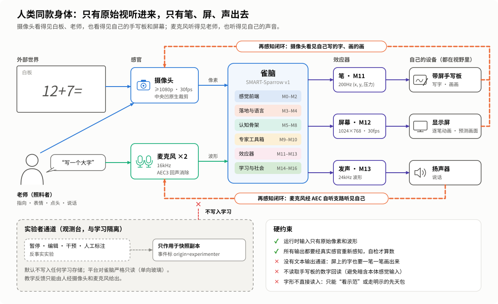
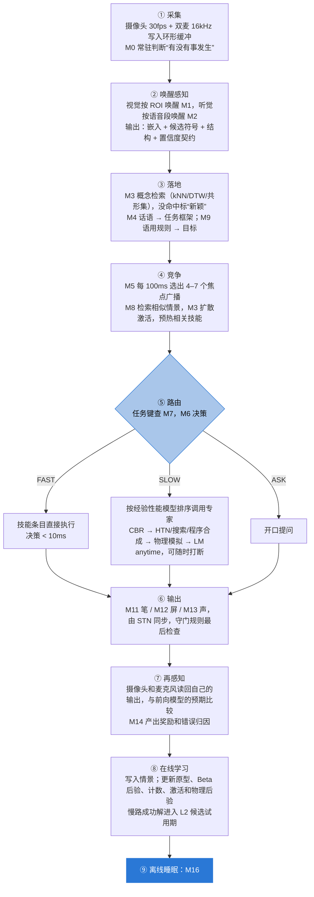
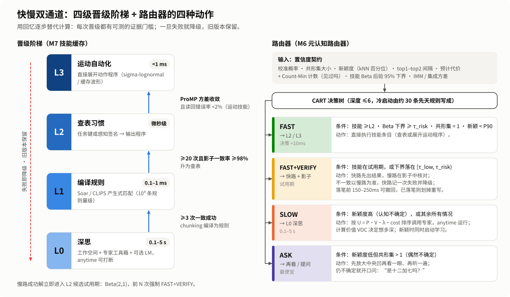
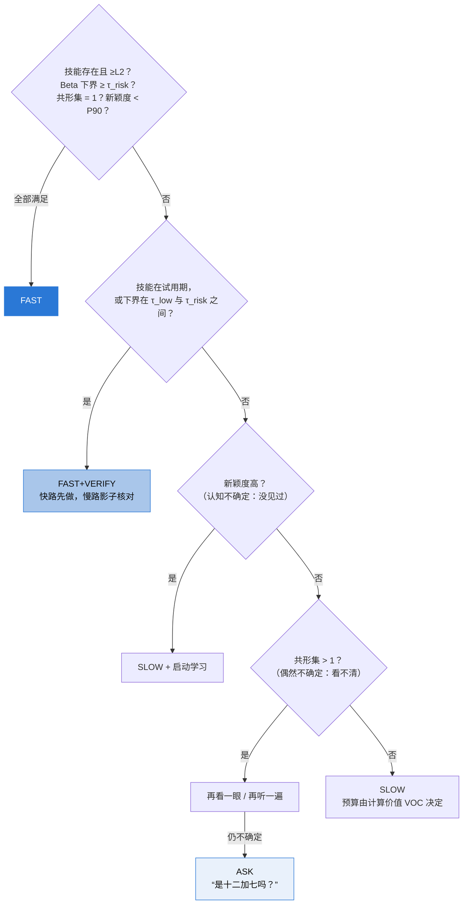
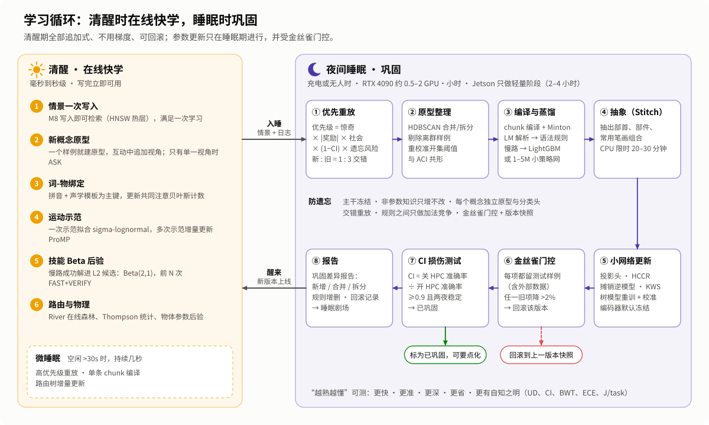

# 雀脑设计（二）：雀脑 v1 综合架构

> 本系列介绍 SMART-Sparrow（雀脑）v1 的设计。这是第二篇，也是核心的一篇：雀脑由哪些模块组成，每个模块用什么算法，为什么这样选，它怎样学习、怎样变熟练。
>
> [设计文档目录](README.md) ｜ 上一篇：[← 五条候选路线与评审](01-five-routes.md) ｜ 下一篇：[上帝视角观测平台 →](03-god-view-platform.md)

---

## 一、一图看懂

  

雀脑 v1 的全称是：**事件门控双通道 × 落地束工作空间 × 互补记忆 × 闭环身体**。

- **主干**来自路线 C（快慢双通道·算法超市）：事件闸门、级联感知、统一置信度契约、浅树路由器、技能缓存和算法选择。
- **认知骨架**来自路线 A：落地束（一个概念能认、能写、能画、能说）、带因果父 ID 的全局工作空间事件流、Soar 式 impasse 与 chunking。
- **学习引擎**来自路线 E：海马情景库、L0–L3 晋级阶梯、巩固指数与损伤实验。
- **身体**来自路线 D：输出必须经真实感官重新感知的闭环、示范学习、运动等价、ProMP 分布。
- **预测层**来自路线 B：IMM 运动模式、引擎与残差的精度加权融合、惊奇信号、两类不确定性的拆分。

文中所有数字都用核查修正后的口径：FLOPs 和 MACs 分开写，延迟按“语音端点检测占大头”来估算。所有算力和延迟都是估算，需要在 MVP 中实测。

## 二、设计原则

五条原则贯穿全部模块：

1. **神经网络只守两端。** 输入端把像素和波形压成嵌入、候选符号和几何量；输出端把运动和发音计划变成波形和少量像素。中间的记忆、判断、推理、规划和调度，全部交给非参数结构和经典算法：它们几乎不占参数，在 CPU 上以微秒到毫秒运行，而且本身可解释。
2. **注意力就是算力。** 事件闸门决定要不要醒，数字中央凹决定看多细，路由器决定想多深。静态场景下只有闸门在跑。
3. **用回忆逐步替代计算。** 任务沿 L0 深思 → L1 编译规则 → L2 查表 → L3 运动自动化逐级晋级，每一级都有可测的证据门槛；晋级、降级、回滚全部记录在案。
4. **一个概念，多路读出。** 概念中枢的每个节点挂一个落地束：识别原型、词音模板、笔迹程序、草图程序、发音串、关系和物理先验。认识、会写、会画、会说是同一个表示的不同读出，彼此还能互相验证（分析-合成）。
5. **一切有地址、有来源。** 任何输出都能顺着因果父 ID 追到输入片段、规则、情景和模型版本。知识按来源分四色：**先天固件、示范习得、自我发现、实验者注入**。这样在上帝视角里能分清哪些是学会的、哪些是写进去的。

## 三、身体与 I/O

  

| 部位 | 规格 | 说明 |
|---|---|---|
| 眼睛 | 1 个广角摄像头，传感器至少 1080p，建议 4K，30fps | 周边通路在降采样后的 160×120 灰度图上工作；“数字中央凹”按原生分辨率裁出 224–448 像素的窗口送给重模型。可另加一个对准手写板和白板的窄视场摄像头，它输入的仍是原始像素 |
| 视野布置 | 人、白板、系统自己的带屏手写板（哑光屏减少反光）、系统自己的显示屏，都在摄像头视野里 | 系统写的字、画的画，只能经摄像头重新看到 |
| 耳朵 | 2 个麦克风，16kHz | WebRTC AEC3 以扬声器输出为参考做回声消除，同时保留一路自听支路；GCC-PHAT 只估粗方向（15cm 间距下约 10° 量级，分不清前后） |
| 输出一：屏幕 | 1024×768，30fps | 屏幕上的文字只能由笔画程序画出来，守门规则禁止用字体渲染“打字” |
| 输出二：扬声器 | 22.05 或 24kHz | — |
| 输出三：手写板 | (x, y, 压力, t, 抬笔/落笔)，200Hz | 系统**不读取**手写板的数字回读，否则等于暗中多了一路本体感觉输入 |
| 实验者通道 | 观测台上的暂停、编辑、干预和人工标注 | 与系统隔离，默认不写入任何学习存储；反事实实验只在快照副本上运行 |

**为什么摄像头要 1080p 起步？** 核查算过：640×480 广角画面里，一个 3cm 高的汉字只有约 15 像素，手写字和白板都读不了。

**没有文本通道。** 系统内部当然有“文字”（语音识别和文字识别的结果），但它们只是内部中间表示，既不能从外部直接输入，也不能直接输出。

## 四、6 层 19 个模块

| 层 | 模块 | 一句话职责 | 核心组件 | 神经参数 |
|---|---|---|---|---|
| 一 感觉前端 | M0 事件闸门与感觉缓冲 | 决定何时何处唤醒网络 | 帧差/MOG2、Silero VAD、中文关键词检测 | 约 0.5–0.8M |
| | M1 视觉级联 | 像素 → 物体、嵌入、符号、几何 | MobileNetV3、DINOv2-S、EdgeSAM、MediaPipe、PP-OCRv5 | 约 45–50M（常驻部分） |
| | M2 听觉前端 | 波形 → 候选词、拼音、声调、说话人 | AEC3、流式 Zipformer、DTW、YAMNet、ECAPA | 约 24–78M |
| 二 落地与语言 | M3 概念中枢与落地束 | 一个概念能认、能写、能画、能说 | 原型分类、共同注意贝叶斯、ACI 共形 | 约 5M |
| | M4 语言理解 | 话语 → 任务框架 | 句式语法、CRF、LightGBM；按需 Qwen2.5-0.5B | 按需 494M |
| 三 认知骨架 | M5 全局工作空间 | 意识舞台与输出调度 | 黑板、联盟竞争、简单时间网络 | 0 |
| | M6 元认知路由器 | 决定快、慢、核对还是提问 | 置信度契约 + 深度 ≤6 的决策树 | 0 |
| | M7 技能缓存 | 熟练行为查表执行 | Soar 或 CLIPS、L0–L3 晋级 | 0 |
| | M8 海马情景记忆 | 一次写入的经历库 | HNSW + IVF-PQ、冷热分层 | 0 |
| 四 专家工具箱 | M9 符号推理与规划 | 精确计算、逻辑、规划、程序合成 | SymPy、clingo、GTPyhop、Stitch | 可选 2–5M |
| | M10 世界模型 | 预测接下来会怎样 | 卡尔曼 + IMM、解析积分、pymunk | 可选约 1M |
| 五 效应器 | M11 笔运动系统 | 写字、画线 | sigma-lognormal、ProMP、摊销逆模型 | 约 11M |
| | M12 屏幕渲染 | 画画、放“想象”视频 | Skia/Cairo、线稿网络、精灵合成 | 按需约 10M |
| | M13 语音输出 | 说话 | 读数规则、Matcha-TTS + Vocos | 约 32M |
| 六 学习·社会·观测 | M14 自我监控与社会反馈 | 读回自己的输出、感知表扬和否定 | 读回识别、点头 HMM | 0（复用） |
| | M15 好奇心与练习调度 | 空闲时决定练什么 | 学习进度老虎机 | 约 0 |
| | M16 睡眠巩固引擎 | 离线整理、编译、蒸馏、防遗忘 | 交错重放、金丝雀回归 | 0（不增推理参数） |
| | M17 上帝视角观测台 | 事件溯源、回放、观测 | 见[第三篇](03-god-view-platform.md) | 0 |
| | M18 先天固件清单 | 公开所有“写进去”的知识 | 清单 + 消融 | — |

下面逐个说明。每个模块按“做什么、怎么做、为什么这样选”三部分介绍。

### 第一层 感觉前端

**M0 事件闸门与感觉缓冲**（源自 C、E）

- **做什么**：常驻的“丘脑闸门”，用几乎零成本的信号处理决定何时、何处唤醒神经网络；另存 30 秒视听环形缓冲，供事后回看。
- **怎么做**：视觉闸门是 160×120 灰度帧差加 MOG2 背景建模（30fps），加谱残差显著性，以及只在变化区计算的 Farnebäck 光流（10fps）。听觉闸门是 Silero VAD（约 0.3M，每块 32ms）。中文 DS-CNN 关键词检测（0.2–0.5M，需要自采数据）只认“写、画、说、这是、对、不对、好、错了”这类词，**只用于预热下游和检测社会反馈，不单独触发动作**。
- **开销**：单核 CPU 的 10–15%（核查修正值）。
- **为什么**：这是低算力的第一道闸，静态场景下几乎只有它在跑。30 秒缓冲让“听到‘这是咕咕’后，回看 2 秒前的指向手势”成为可能。

**M1 视觉级联**（源自 C、A，已按核查修正）

- **做什么**：由廉到贵、能早退就早退，把画面变成物体档案、嵌入、符号和几何量。
- **怎么做**：

| 环节 | 组件 | 参数与算力 |
|---|---|---|
| 周边要旨 | MobileNetV3-Small（去分类头），每秒 2 次 | 约 1.5M，56M MAdds/帧 |
| 类别无关物体提议 | MOG2 运动团块 + 低频（≤1Hz）EdgeSAM 网格提示扫描 + 指向手势提示；需要常见物体检测时用 YOLOX-Nano / NanoDet / PP-PicoDet | 约 1–2M（待核实） |
| 中央凹语义 | DINOv2 ViT-S/14；嵌入按跟踪 ID 缓存，外观变化超过阈值才重算，平均每秒 2–5 个裁剪 | 21M；224 裁剪约 6 GMACs，即约 12 GFLOPs |
| 分割 | EdgeSAM，只在关键帧编码一次，多个提示共用；帧间掩码用卡尔曼加光流传播；难跟踪片段按需调用 SAM 2.1-Tiny | 9.6M，约 20 GMACs/帧；SAM 2.1-Tiny 38.9M |
| 跟踪 | ByteTrack/SORT 式跟踪器维护物体档案；被注意的动态物体另起常加速度卡尔曼 + IMM（静止、斜面滚动、自由落体、弹跳） | 0 |
| 人 | MediaPipe Hand / Pose / Face Landmarker，只在有人时以 10–15fps 运行；输出指向射线、近似视线的头部朝向、笑脸、点头用的头部俯仰序列 | 约 5–8M（待核实） |
| 文字与符号 | PP-OCRv5 mobile（官方支持手写）；数字与运算符小 CNN + 个性化 kNN 样例库；手写汉字识别小 CNN（HCCR，自训）。流程：白板四边形 → 单应校正 → Sauvola 二值化 → 连通域 → 版面规则（上下两道平行短横合并成“=”） | 约 5M + 0.5M + 3M |
| 几何原语 | Hough 圆、LSD 直线、RANSAC、轮廓与中轴 | 0 |

- **为什么**：MobileSAM 每次约 39 GMACs，EdgeSAM 约 20 GMACs 且是纯 CNN，更适合边缘设备；YOLOv8 是 AGPL 许可，改用 Apache-2.0 的检测器；ToMe 和 token 缓存互相冲突，不叠在一起用。“类别无关物体提议”补上了其它方案都缺的一块：发现**静止不动**的新物体。

**M2 听觉前端**（源自 A，加上 B/D 的回声消除与自听，已按核查修正）

- **做什么**：把波形变成带时间戳的候选词、拼音、声学模板、声调、说话人和非语音事件。
- **怎么做**：主流程是 AEC3 → Silero VAD → 流式中文 Zipformer-Transducer（sherpa-onnx；边缘版 14M，标准版为 WenetSpeech 训练的约 68M），输出部分假设、n-best 和字级时间戳。
  - **语义早端点**：句式语法完整、句末降调、静音至少 250ms 三者同时满足才提前结束，否则等 500–800ms；因为比 sherpa-onnx 默认的 1.2s 激进得多，配了 150–250ms 的撤回窗口。
  - **词的声学身份**：在 ASR 编码器帧特征或 MFCC 上做 DTW 模板匹配；用 segmental DTW（Park & Glass 2008）发现重复出现的新词；pypinyin 转拼音；基频用 WORLD 的 Harvest/DIO 流式估计，靠声调区分 da4（大）和 da2（达）。
  - **其它**：YAMNet（3.7M）识别非语音事件；ECAPA-TDNN 区分教学者（C=512 版 6.2M，用现成 C=1024 权重则按 14.7M 计）；GCC-PHAT 估粗方向。
- **为什么**：Whisper 固定 30s 窗口、非流式、中文字错率高，不适合常驻；SenseVoice-Small 有 234M 且非流式。词以“拼音 + 声学模板”为主键，是为了在 ASR 把“咕咕”听成“姑姑”时仍能找到正确的词。

### 第二层 落地与语言

**M3 概念中枢与落地束**（源自 A、D、C、E）

- **做什么**：“懂”的载体。每个概念是一个 hub 节点，挂着认、写、画、说所需的全部 spoke；同时负责词-物绑定和开集识别。
- **一个概念挂什么**：
  - 视觉原型：多视角 DINOv2 嵌入；分类用 NCM 加 Deep SLDA 增量头，再加一个用预计算负例库训练的 Exemplar-SVM（训练 10–100ms）。照片域原型和线稿域原型分开存，解决草图与照片的域差。
  - 词：以拼音和声学模板为主键，汉字只是附属。
  - 笔迹程序、草图程序、发音串与声调。
  - 属性谓词：颜色、形状、大小由证据直接计算；材质、类属等标为“未知，待交互获得”。
  - 知识图谱关系边：带置信度和出处 episode_id。
  - ACT-R 基础激活、理解深度分数 UD、巩固指数 CI。
- **词-物绑定**：共同注意贝叶斯模型，依据 Frank, Goodman & Tenenbaum 2009 的说话者指称意图思想、Markman & Wachtel 1988 的互斥偏置和 Yu & Smith 2007 的跨情境计数。结构固定后预编译成 NumPy 闭式计算，<1ms，不在线跑 pgmpy。
- **开集识别**：以 kNN 距离百分位为主（在 384 维上比 Isolation Forest 可靠）；共形集用 ACI（Gibbs & Candès 2021）或按概念分组的 Mondrian 共形，以应对在线漂移。
- **存储**：SQLite/DuckDB + NetworkX；索引用 hnswlib/FAISS。神经部分只有投影头和属性探针，约 5M。
- **为什么**：把知识存成可寻址、可删除的结构，而不是塞进网络权重，既可观测，又天然不遗忘。

**M4 语言理解**（源自 A、C）

- **快通道（<5ms）**：Lark Earley 或 WFST 句式语法；sklearn-crfsuite 做槽位；LightGBM 做意图（特征是字 n-gram）；未登录的槽保留音频指针，交给 M3 做声学匹配；数词互转用 WeTextProcessing 的 FST。
- **慢通道**：Qwen2.5-0.5B-Instruct（494M，int4 GGUF 约 0.4GB，按需懒加载），用 LoRA 微调成语义解析器；用 llama.cpp 的 GBNF 语法约束它只能输出任务 DSL，再做符号类型检查；上下文压到 512 token 以内。
- **摊销**：LM 的解析结果在睡眠中蒸馏成新的语法规则和 CRF/GBDT 样本，目标是熟悉领域的 LM 调用率降到 5% 以下。
- **为什么**：意图分类用 LightGBM 而不用 38M 的 RBT3；兜底模型选 Qwen2.5-0.5B，因为 SmolLM2 基本不会中文。语言模型只产出结构化的任务框架，**从不直接产生输出**。

### 第三层 认知骨架

**M5 全局工作空间 / 黑板**（源自 A、C）

- **条目**：{类型化符号内容, 置信度契约字段, 来源证据链（因果父 ID）, 显著性特征, 存活期 TTL}。
- **仲裁**：10Hz 认知周期（这是工程设定，不宣称符合 LIDA 的时序）；容量 4–7 个组块，以“联盟”为单位入选，例如“咕咕”这个词、物体 #1734 和指向手势一起入选。冷启动用手写的线性权重，日志攒够后换 LightGBM 排序器；训练标签用**资格迹**做时间信用分配，不把“成功之前的焦点”直接当作监督信号。
- **输出调度**：用简单时间网络（STN）同步三路输出，例如“写 19”和“说十九”同时开始。
- **观测**：意识剧场、目标栈、广播日志，以及由焦点内容按模板生成的“内心独白”（只在观测台显示，不属于输出）。

**M6 元认知路由器**（源自 C、E、A，加上 B 的不确定性拆分）

- **输入：置信度契约**。isotonic 校准后的概率、共形集大小、新颖度（kNN 百分位）、top1 与 top2 的间隔、预计代价；另加 Count-Min Sketch 计数（微秒级回答“见过吗”）、技能 Beta 后验的 95% 下界、IMM 或模型集成的方差。
- **决策器**：深度不超过 6 的 CART 决策树。冷启动时是一棵由约 30 条先天规则写成的初始树，日志积累后重训。输出 FAST / FAST+VERIFY / SLOW / ASK 之一。
- **慢通道内部的算法选择**：每个专家配一个随机森林，预测成功率和耗时（Hutter et al. 2014 的经验性能模型思路）；按期望效用 U = P·V − λ·cost 排序；用 Thompson 采样保留少量探索；空闲时让其它档“影子运行”，补齐反事实标签，修正选择偏差。
- **为什么是浅树**：CART 的路径本身就是精确解释，每一次路由都能在观测台上逐节点回放。

**M7 程序性记忆 / 技能缓存**（源自 C、E、A）

- **引擎**：Soar（C++，有 SML Python 绑定，自带 chunking、情景记忆和语义记忆），或 CLIPS（通过 clipspy）。不用 experta（已停止维护，不兼容 Python 3.10+），也不用 pyactr 做实时引擎。
- **技能条目**：键是 (意图, 规范化槽位, 情境签名)；值是运动程序、答案、渲染模板或缓存波形；附带等级 L0–L3、Beta 成功率后验、使用次数、延迟分布、效用，以及出处（由哪些慢路轨迹编译而来）。
- **晋级与剪枝**：门槛见第六节；用 Minton 效用检验定期剪除低效规则，防止规则越多越慢。
- **观测**：练习曲线同时拟合幂律和指数律（参考 Heathcote et al. 2000）；晋级和降级事件流；chunk 出处树。

**M8 海马情景记忆**（源自 E、A）

- **事件分割**：以预测误差尖峰、VAD 端点、视觉突变为边界。
- **条目**：时间、情境、事件嵌入、各模态子键；负载指针（关键帧 JPEG、掩码 RLE、Opus 音频、n-best、OCR 串）；自身动作轨迹、结果、奖励、惊奇、显著性、巩固状态。
- **索引**：新写入用 HNSW，历史条目用 IVF-PQ，另有实体倒排表和时间链。检索取 top-50 后，可选用现代 Hopfield 网络一步更新（Ramsauer et al. 2020）重排，做跨模态补全：只听到“咕咕”也能想起它长什么样。
- **分层存储**：热层是 PQ 码加元数据，10⁶ 条在 1GB 以内；冷层是原始裁剪和音频，按价值只保留每个概念的 top-k 视角，约 20–200GB；已巩固且激活低的条目做要点化。
- **键的稳定性**：键取自冻结的 DINOv2。如果启用 LoRA，只改 9–12 层、键取第 8 层输出，或者加 BCT 兼容约束，保证旧记忆仍能检索到。
- 这里的“遗忘”指**想起来变慢**，不是被删除。

### 第四层 专家工具箱

**M9 符号推理与规划**（源自 A、C）

- **表达式**：Lark/Pratt 解析，加精确的整数和有理数算术，以及 SymPy。“算术事实表”和“实时计算”两路竞速（依据 Logan 实例理论和 Siegler 的 ASCM 模型）。
- **逻辑**：clingo 或 Soufflé；概率逻辑用 Scallop。ProbLog 每次查询都要做知识编译，耗时数十到数百 ms，只在深思档调用。
- **规划**：GTPyhop（HTN）、A*、MCTS（UCT）；版面约束用 OR-Tools CP-SAT。
- **程序合成**：在小 DSL 上做类型导向枚举，加案例改编。库学习用 Stitch（比 DreamCoder 快几个数量级），每晚限时运行。可选一个 2–5M 的引导网络。

**M10 世界模型与心理模拟**（源自 A、B、C，已按核查修正）

- **测量**：MOG2 前景团块加 Hough 圆得到亚像素级的球心和半径，**不用** 16×16 的槽掩码来测量；LSD 找斜面线和地面线。先做相机几何检查：不是侧视时先估平面单应，估不出来就标为“超出适用范围”，退回 kNN 历史轨迹外推。
- **状态与参数**：常加速度卡尔曼加 IMM 模式概率。直接在像素空间拟合有效加速度和滚动阻力（尺度和滚动损耗无法同时辨识，所以不求米制单位）；地面摩擦和恢复系数在碰撞前观测不到，从语义记忆里取该物体或材质的先验分布，渲染成多假设扇形。
- **向前推演**：斜面加地面这类有解析解的场景，用 NumPy 向量化积分，<5ms；需要碰撞时用 pymunk，并手动设 moment = 0.4·m·r²（pymunk 默认按圆盘算）和接触摩擦（默认为零），用单元测试核对仿真与解析解；粒子数 64–200；可选一个约 1M 的 Interaction Network 学残差。
- **融合与惊奇**：残差集成方差大时更多依赖物理引擎（精度加权）；惊奇定义为预测误差的负对数似然，同时充当事件边界、注意信号和重放优先级；定性物理（QPT）状态机生成可以说出口的预测。
- **用词约束**：学到的交互关系只叫“交互边”；只有经过干预检验（在屏幕沙盒里亲手操作，或引擎做反事实模拟）的，才升级为“因果边”。

### 第五层 效应器

**M11 笔运动系统**（源自 D、A、E，已按核查修正）

- **表示**：运动程序以**视觉坐标**存储（运动等价），同一个程序既能写在手写板上，也能画在屏幕上。每个笔画由 K≈2–8 个 sigma-lognormal 分量叠加，参数用 iDeLog 或 ScriptStudio 从观察到的笔尖轨迹中提取；一个字 = 笔画序列 + 相对布局（BPL 式部件程序）；ProMP 在这些参数上存均值和对角或低秩协方差，笔画基元跨字共享。
- **身体图式**：先随机画笔画（牙牙学语），摄像头看到墨迹后，用 RANSAC 估计手写板到相机的单应和“输出→再感知”的时延；之后每次书写都顺便在线重新标定。
- **逆模型三档**：① 取缓存程序；② 摊销网络（约 8M），从概念或字形图像直接出笔画参数；③ 在低维残差子空间里做 CEM 或梯度搜索，前向模型用 PyTorch 批量 SDF 或高斯笔刷光栅化（64×64，可选约 3M 神经渲染器），不用 DiffVG 逐个渲染。
- **执行与精修**：50Hz 生成、插值到 200Hz 流式输出；抬笔移动用最小 jerk 轨迹；压力由速度-压力模型给出。用**摄像头读回**的墨迹算误差（HCCR 读回 + 与模板的 Chamfer 距离），做 ILC 式修正，不用内部渲染自己验证自己。
- **研究项**：条件 RNN 汉字风格生成（参考 Zhang et al. TPAMI 2018）。

**M12 屏幕渲染**（源自 A、D、C）

- **画笔模式**：Skia/Cairo 逐笔动画，与 M11 共用运动程序；用 k-means 取主色平涂。
- **草图**：照片 → 线稿网络（Chan, Durand & Isola 2022，约 10M，按需加载）→ RDP 轮廓简化 → 部件分解（中轴或凸分解）→ 笔画排序（贪心加 2-opt）。v1 是“按记忆描绘”，v2 是“用部件程序重绘”；新姿态用部件旋转加 ARAP 形变。Potrace 是 GPL 许可，隔离成可选插件。
- **想象回放**：EdgeSAM 抠出物体“精灵”；多帧中值或 Telea 修补背景；刚体变换（旋转角 = 路程 / 半径）；运动模糊；半透明的不确定性“幽灵”。
- **神经图像生成**：不进 MVP。研究预留 ≤100M（例如参考 RCG 思路、以 DINOv2 表征为条件的小型 MaskGIT 类生成器），**不承诺一次学习之后就能生成新视角**。

**M13 语音输出**（源自 A、C、E）

- **规划**：模板 NLG（SimpleNLG-ZH 思路）；数字读法规则（19 读作“十九”，10–19 省略“一”，“二”和“两”的选用）；多音字词典；韵律规则。
- **合成**：Matcha-TTS 中文（sherpa-onnx 的 matcha-icefall-zh-baker，18.2M）加 Vocos（13.5M）。Baker 数据限非商用，开源发布时要自录“自己的嗓音”或用许可合适的数据重训。不用 MeloTTS 中文，它依赖 167–326M 的 BERT。
- **缓存与新词**：高频短语预先合成，命中直接播放；新词按学到的拼音合成，需要贴近老师的腔调时用 WORLD 迁移 F0 轮廓（只迁韵律，不做音色转换）。
- **自听**：麦克风 + AEC 自我声道 → ASR，再与模板做 DTW。

### 第六层 学习、社会与观测

**M14 自我监控与社会反馈**（源自 D 的闭环、A 的核查缺口、E）

- **真实感官闭环**：摄像头读回手写板和屏幕，麦克风听回自己的语音。
- **防止循环验证**：读回识别器的训练集和校准集里，固定保留一定比例的外部数据（真人书写、真人语音、摄像头重拍的样本）。**自检只能小幅更新 Beta 后验，外部反馈才能大幅更新。**
- **社会反馈检测器**：反馈关键词（对、不对、好、错了）、韵律、笑脸、点头（头部俯仰序列 + HMM），输出带来源标记的奖励事件。
- **错误归因与输出修复**：区分感知错、检索错、执行错。笔迹无法撤销，写错时执行“划掉，在旁边重写”，同时口头说“写错了”。

**M15 好奇心与练习调度**（源自 D，轻量版）

空闲时用学习进度（LP）老虎机挑练习活动：重练最近读回出错的字；在屏幕上的“物理沙盒”里用笔当鼠标摆斜坡、放小球，获取干预数据；复习 CI 低的概念。预测误差只作辅助信号，避免“噪声电视”陷阱（被随机噪声吸引、白白浪费注意）。

**M16 睡眠巩固引擎**：见第七节。**M17 上帝视角观测台**：见[第三篇](03-god-view-platform.md)。**M18 先天固件清单**：见第十一节。

## 五、数据流：一次完整循环

全程每一步都向 M17 发布带因果父 ID 的事件。

## 六、快慢通道：四级阶梯与路由规则

  

| 等级 | 名称 | 怎么执行 | 耗时 |
|---|---|---|---|
| L3 | 运动自动化 | 直接展开动作程序（笔的 sigma-lognormal/DMP、缓存的波形） | < 1ms |
| L2 | 查表习惯 | 任务键或感知签名直接映射到输出程序 | 微秒级 |
| L1 | 编译规则 | Soar/CLIPS 产生式匹配（规则 10⁴ 量级，CPU） | 0.1–1ms |
| L0 | 深思 | 工作空间 + 专家工具箱 + 可选语言模型，anytime，可随时打断 | 0.1–5s |

**晋级门槛**（全部可测、可回滚）：

| 晋级 | 条件 |
|---|---|
| L0 → L1 | 同类慢路轨迹一致成功 ≥3 次，经 chunking 编译为规则 |
| L1 → L2 | 使用 ≥20 次，且影子运行一致率 ≥98% |
| → L3（运动技能） | ProMP 方差收敛，且读回错误率 < 2% |
| 降级 | 一旦失败就降级，旧版本保留 |

新条目进入 L2 候选时有试用期：初始 Beta(2,1)，前 N 次强制走 FAST+VERIFY。

**路由规则**（示意，阈值随风险调整）：

几个细节：

- **两类不确定性分开处理**：“没见过”（认知不确定）就去学；“看不清”（偶然不确定）就再看或提问。认知不确定性只在练习或探索模式下当奖励，执行任务时当惩罚。
- **快慢不一致时**，以慢路为准并纠正。笔的纠正方式是：落笔前有 150–250ms 悬停撤回窗口；已经落笔就划掉重写。快路记一次失败并降级。
- **计算价值（VOC）**：只有“预期收益 × 风险权重 > 计算代价”时才继续深想。
- **预期激活**：熟悉的句式刚开头（“写一个……”），就按情境签名预热目标和运动程序，话音一落即可落笔；撤回窗口负责防止误触发。

## 七、在线学习与睡眠巩固

  

雀脑的学习分三个时间尺度，对应互补学习系统理论中“海马快学、新皮层慢学”的分工。

**在线快学（毫秒到秒级，不用梯度，全部追加式、可回滚）**

1. 情景一次写入，写完立即可以检索。
2. 新概念：一个样例就建立原型；互动中逐步追加视角；只有单一视角时主动问“能转一下给我看看吗？”
3. 新词：记下拼音和声学模板，更新贝叶斯绑定计数。
4. 运动：一次示范就用线性回归拟合 sigma-lognormal/DMP 参数；多次示范增量更新 ProMP；读回误差驱动 ILC 式修正。
5. 规则：慢路的成功解立即进入 L2 候选试用期。
6. 路由与排序器：用 River 的在线森林增量更新，同时更新 Thompson 采样的统计量。
7. 物理：每次观察后更新该物体的参数后验。

**微睡眠（空闲超过 30 秒时，持续几秒）**：高优先级重放、单条 chunk 编译、路由树增量更新。

**夜间睡眠（充电或无人时；RTX 4090 上约 0.5–2 GPU·小时，Jetson 上只做轻量阶段，约 2–4 小时）**

1. **盘点与采样**：优先级 = 惊奇 × |奖励| × 社会显著性 × (1 − CI) × 遗忘风险；按新:旧 = 1:3 交错抽样，旧样本包括 iCaRL herding 样例和 PQ 压缩特征。
2. **原型整理**：用 HDBSCAN 合并或拆分概念，剔除离群样例，重新校准开集阈值和 ACI。
3. **编译与蒸馏**：批量编译 chunk 并做效用检验；把 LM 的解析蒸馏成语法规则和 CRF/GBDT 样本；把慢路决策蒸馏成 LightGBM 或 1–5M 的小策略网；缓存草图程序和运动程序。
4. **抽象**：Stitch 库学习，抽出部首、部件、常用笔画组合（CPU 上限时 20–30 分钟）；统计定性物理规则；更新物理参数的层级先验。
5. **参数更新（只动少量小网络）**：投影头与探针；HCCR 个性化；摊销逆模型（用真实示范加自己的成功样本训练，生成式重放只用于笔迹并用外部数据锚定）；关键词检测加入新词；所有树模型重训并校准；路由器和经验性能模型用影子运行得到的标签重训。编码器默认冻结；如启用 LoRA，就配 EWC/LwF 和 BCT。
6. **门控**：先跑金丝雀回归，每个技能和概念都保留测试样例（含外部数据），任何旧项下降超过 2% 就回滚该版本；再做海马损伤测试，CI = 关闭海马检索时的准确率 / 开启时的准确率，CI ≥ 0.9 且连续两夜稳定，标为“已巩固”，允许要点化。
7. **报告**：生成巩固差异报告（新增、合并、拆分的概念，增删的规则，新原语，回滚记录），推送到观测台的“睡眠剧场”。

**防遗忘的几道防线**：主干冻结；非参数知识只增不改；每个概念有独立的原型和分类头；交错重放；规则之间只做加法竞争；金丝雀门控加版本快照；被纠正的旧版本以情景形式留档。

**“越熟越懂”从哪里来，怎么量**

| 维度 | 机制 | 可测指标 |
|---|---|---|
| 更快 | 实例竞速、规则编译、缓存、预期激活；熟悉场景下编码器降频 | 练习曲线、快通道覆盖率 |
| 更准 | 原型更密、共形集收缩、ProMP 协方差收紧、物理先验收敛、个性化样例积累 | 共形集大小、读回错误率、预测误差 |
| 更深 | 概念 hub 的 spoke 数和知识图谱度数增长；部件库复用（新字共享偏旁）；策略演化（数全部 → 接着数 → 直接检索） | UD、部件复用率 |
| 更省 | LM 调用率下降，每任务能耗下降 | LM 调用率、J/task |
| 更有自知之明 | 校准越来越好 | ECE |

**理解深度 UD** 是以下各项的加权和：落地模态数 / 5、log(1 + 知识图谱度)、关联技能数、1 − 预测误差、log(1 + 成功使用次数)、CI。观测台对每个概念持续显示 UD。

## 八、三路输出的生成与同步

| 输出 | 生成流程 |
|---|---|
| 手写板 | 字、数字或草图 → 部件程序 → ProMP 采样 → sigma-lognormal 展开 → 身体图式映射到板面坐标 → 200Hz 流 |
| 屏幕 | 笔画动画（与手写共用运动程序）、精灵合成视频、线稿与部件程序；研究用的图像生成器默认关闭 |
| 声音 | 逻辑形式 → 模板或读数规则 → 拼音与韵律 → 缓存波形或 Matcha + Vocos 合成 → 流式波形 |

同步由 STN 表达“同时开始”“最后一笔之后 ≤200ms 开口”这类约束，执行时滚动检查，任何一路延迟都会相应调整其它路。三路输出都经真实感官读回，结果写回情景并更新后验。

## 九、S1–S4 走查

以下延迟为核查修正后的估算；GPU 指 RTX 4060 笔记本，CPU 指 8 核笔记本。

### S1 熟悉任务：“写一个‘大’字”

1. VAD 开门；关键词检测听到“写”，预热笔运动系统和常用字的程序。
2. 流式 Zipformer 输出部分假设“写一个大字”；声调轮廓为 da4，排除 da2（达）和 da3（打）。
3. 句式“写(一个)?X字”命中，CRF 填槽 X = 大；同时满足语义早端点条件。
4. 任务键 (WRITE_CHAR, 大, 手写板) 命中 L2 技能（比如练过 412 次，Beta 后验下界 0.97），共形集为 {大}，新颖度低 → **FAST**，决策 < 10ms。
5. 从 ProMP 采样一个自然变体，按手写板空白区域布局；笔在撤回窗口内悬停后落笔，以 200Hz 输出。写完约 1.0–1.5s，可加速到约 0.6s。
6. 摄像头读回墨迹，HCCR 识别为“大”，Chamfer 距离小 → 小幅更新后验；听到“真棒” → 社会奖励，大幅更新。

**延迟**：话音结束到落笔，GPU 0.35–0.6s，CPU 0.5–0.9s，主要花在端点检测和 ASR 上，认知决策 < 10ms。

**第一次（从没见人写过“大”）**：没有技能也没有字形程序 → impasse → ASK：“我还不会写，能写给我看吗？” 老师在镜头前写一遍，或播放由 Make Me a Hanzi 渲染的书写视频（来源标为“先天包/示范”）→ 笔尖跟踪 → HMM 分段 → iDeLog 提取参数 → 模仿书写 → 读回核对。成功 3 次编译为 L1，20 次且影子一致升为 L2。首次规划需要 1–3s，另加一轮示范对话。

### S2 少样本新概念：“咕咕”

**教学阶段**

1. 玩具静止放着，由低频 EdgeSAM 网格扫描或指向提示发现；它的 DINOv2 嵌入与所有原型的距离都超过开集阈值 → 判为新颖。
2. 指向射线沿图像平面采样，取射线上第一个显著的非手物体作为 EdgeSAM 提示，得到掩码；头部朝向与指向一致。
3. 两次“咕咕”由 segmental DTW 判为同一个词。ASR 候选里有“咕咕”和“姑姑”，以拼音 gu1gu1 加声学模板为主键，不依赖汉字。
4. 共同注意贝叶斯模型综合互斥偏置（新词对新物）、指向和时间同步，P(咕咕 → 该物体) 超过阈值 → 新建概念 hub（视觉原型、两条声学模板、首次情景指针）。原型要等跟踪稳定、积累几个视角后生成，约需 0.5–2s。
5. 属性只写证据推得出的（颜色、形状、大小、部件）；“软不软”“是不是玩具”标为未知。只有一个视角时问：“能转一下给我看看吗？”

**执行阶段（“画一个咕咕”）**

6. 句式 DRAW(X)；X 按拼音加 DTW 找到“咕咕”，即使 ASR 写成了“姑姑”。
7. 还没有这项技能 → SLOW。HTN 分解为：选视图 → 线稿网络 → RDP 简化 → 部件分解 → 2-opt 笔画排序 → 版面 → 渲染 → 说话。
8. 在屏幕上逐笔画出（2–4s），再用主色平涂。
9. 话语脚本“展示作品时命名：这是 X”来自先天句式种子，或从照料者“这是球”“这是猫”的示范中归纳；最后一笔之后 ≤200ms 开口。
10. 自检：把摄像头拍到的画与一个**没参与描图**的视角的线稿域原型比较（不和源掩码比，避免同义反复）；自听；照料者说“对” → 奖励；草图程序写入 L2 候选。当晚用多视角样例加相似玩具作困难负例更新投影头，CI 开始累计。

**延迟**：第二次命名后 < 0.5s 完成绑定；“画一个咕咕”话音结束到第一笔 0.5–1.0s（线稿网络 GPU 数十 ms、CPU 约 0.2–0.5s）；绘制 2–4s；第二次画走缓存，第一笔 0.4–0.7s。

### S3 物理直觉：小球滚下斜坡

1. **触发**：有人问“接下来会怎样？”（意图 PREDICT）；或者画面冻结、刚才有运动物体、系统正在注视它。后者是一条可学习的约定。
2. 测量和跟踪在观看中已完成：团块加 Hough 圆；卡尔曼 + IMM 切到“斜面滚动”；LSD 得到斜面和地面；侧视检查通过。
3. 如果认出这是熟悉的“红皮球 #12”，就取它的参数先验，收敛更快也更准。
4. 在像素空间拟合有效加速度；NumPy 解析积分向前推 1–2s，64–200 个粒子覆盖不可辨识的阻力和恢复系数；需要碰撞时用修正过的 pymunk。
5. 精灵合成 30–60 帧（旋转角 = 路程 / 半径，加运动模糊和半透明的不确定性扇形）输出到屏幕；可选用 QPT 叙述“它会滚到坡底，在地上滚一段后慢慢停下”。
6. 真实画面出现后逐帧比对：惊奇小就强化当前图式；惊奇大就高优先级写入情景，睡眠时更新先验和残差，并交给 M15 作为第二天沙盒实验的目标。

**延迟**：触发到第一帧预测 0.1–0.3s；用 Python pymunk 批量处理碰撞时 0.2–0.6s。陌生结构（非侧视、多物体碰撞）标为低置信，退回历史轨迹外推，或者直接说“我不确定”。

### S4 符号推理：白板上的“12+7=”

1. **书写完成检测**：写题人的手离开白板区域，300–500ms 内没有新墨迹，而且解析出的结构以“=”结尾。
2. 数字中央凹（或第二个摄像头）取高分辨率白板图 → 单应校正 → 二值化 → 连通域 → 等号合并 → 符号 CNN 加个性化 kNN，得到 1、2、+、7、=，每个带共形集。只要有一个共形集大于 1（例如 7 可能是 1），先放大重看，仍不确定就问：“是十二加七吗？”
3. Pratt 解析得到 Eq(Add(12,7), 空)；规则“以 = 结尾且右侧空白 → 作答”提出目标 ANSWER。
4. **竞速**：事实表查到 12+7=19（微秒级），精确算术同时算出 19（< 1ms），两者一致。
5. **两路并行输出**：在自己的手写板空白区写“19”（与白板是不同表面，所以不存在“写在等号右侧”的问题）；读数规则得到“十九”，命中波形缓存就直接播放；STN 让起笔和发声同步。
6. 读回“19”、自听“十九”；听到“对”或看到点头 → 强化这条事实和对应技能。

**延迟**：书写完成判定之后 0.4–0.7s 开始写和说，完成判定占主导；写“19”约 0.6–1.0s，说“十九”约 0.5s。新颖变体“123×45=”走算术引擎仍 < 1ms；“x+7=19”走 SymPy，约 10–50ms。

## 十、算力与参数预算

| 层 | 模块 | 组件（现成 / 自训） | 神经参数 | 常驻 / 按需 | 典型算力（估算，需实测） | 许可与备注 |
|---|---|---|---|---|---|---|
| 闸门 | M0 | Silero VAD | 约 0.3M | 常驻 | 每 32ms 块 < 1ms（CPU） | MIT |
| 闸门 | M0 | 中文 DS-CNN 关键词检测（自训） | 0.2–0.5M | 常驻 | 可忽略 | 需自采命令词和反馈词数据 |
| 闸门 | M0 | 帧差 / MOG2 / 谱残差 / 局部光流 | 0 | 常驻 | 单核 CPU 10–15% | OpenCV |
| 视觉 | M1 | MobileNetV3-Small（去分类头） | 约 1.5M | 常驻，2Hz | 约 0.11 GFLOPs/帧 | Apache-2.0 |
| 视觉 | M1 | 物体提议：YOLOX-Nano / NanoDet / PP-PicoDet | 约 1–2M（待核实） | 常驻，2–5Hz | 约 1–2 GFLOPs/帧（待核实） | Apache-2.0；不用 AGPL 的 YOLOv8 |
| 视觉 | M1 | DINOv2 ViT-S/14 | 21M | 事件驱动，2–5 个裁剪/s，按轨迹缓存 | 约 12 GFLOPs/裁剪，即 24–60 GFLOPs/s | Apache-2.0 |
| 视觉 | M1 | EdgeSAM | 9.6M | 仅关键帧，≤1Hz | 约 40 GFLOPs/帧（20 GMACs） | 许可待核实 |
| 视觉 | M1 | MediaPipe Tasks：Hand / Pose / Face Landmarker | 约 5–8M（待核实） | 画面中有人时，10–15fps | GPU 5–10ms/帧，CPU 20–40ms/帧 | Apache-2.0 |
| 视觉 | M1 | PP-OCRv5 mobile det+rec | 约 5M | 检测到文字区时，1–5Hz | CPU 约 50–100ms/区域 | Apache-2.0 |
| 视觉 | M1 | 数字/运算符 CNN + 手写汉字识别 HCCR（自训） | 约 0.5M + 约 3M | 按需 | < 10ms | CASIA-HWDB 仅限研究，发布权重需换数据 |
| 听觉 | M2 | 流式中文 Zipformer（sherpa-onnx） | 14M（边缘）/ 约 68M（标准） | VAD 触发后 | 约 2–5 GFLOPs/s | 代码 Apache-2.0，训练数据许可需逐项核对 |
| 听觉 | M2 | YAMNet | 3.7M | 非语音段 | 约 0.14 GFLOPs/s | Apache-2.0 |
| 听觉 | M2 | ECAPA-TDNN（C=512） | 6.2M（用 C=1024 现成权重计 14.7M） | 按需 | 可忽略 | 可选 |
| 落地 | M3 | 投影头 + 属性探针（自训） | 约 5M | 常驻 | < 1ms | — |
| 世界 | M10 | Interaction Network 残差（自训，可选） | 约 1M | 按需 | < 1ms | — |
| 推理 | M9 | 程序合成引导网络（自训，可选） | 约 2–5M | 按需 | — | — |
| 笔 | M11 | 批量光栅前向渲染器 + 摊销逆模型（自训） | 约 3M + 约 8M | 常驻 | 每字 < 5ms | — |
| 声 | M13 | Matcha-TTS 中文 + Vocos | 18.2M + 13.5M | 有语音输出时 | CPU 实时率约 0.05–0.2 | Baker 数据限非商用，发布需改用自录音色 |
| **常驻小计** | | | **标准约 0.18B / 边缘约 0.13B** | | | |
| 语言 | M4 | Qwen2.5-0.5B-Instruct（int4，GBNF 约束解码） | 494M | 按需懒加载 | 约 1 GFLOP/token；CPU 解码 50–150 tok/s | Apache-2.0 |
| 屏 | M12 | 照片 → 线稿网络（Chan, Durand & Isola 2022） | 约 10M | 按需 | GPU 数十 ms，CPU 约 0.2–0.5s | 许可待核实 |
| 适配 | 各模块 | LoRA / 新增小头预留 | 约 10M | — | — | — |
| **标准配置合计** | | | **约 0.70B** | | | |
| 可选 | M1 | SAM 2.1-Tiny（难跟踪片段） | 38.9M | 按需 | GPU 每帧 20–40ms | Apache-2.0 |
| 可选 | M10 | Depth Anything V2-Small（相对深度） | 24.8M | 按需 | — | 仅 Small 版为 Apache-2.0 |
| **标准 + 可选** | | | **约 0.76B** | | | |
| 研究预留 | M12 | 以表征为条件的小型图像生成器 | ≤100M | 按需 | — | 不进 MVP |
| **上限** | | | **约 0.86B（< 1B，余量约 0.14B）** | | | |
| 非神经 | 全局 | CART / LightGBM / 随机森林 / River 在线森林 / Count-Min / 贝叶斯闭式解 / HMM / CRF / DTW / Soar 或 CLIPS / 知识图谱 / 情景库 / NumPy 积分与 pymunk / SymPy / clingo / Scallop / GTPyhop / CP-SAT / Stitch | 0 | 常驻或按需 | 多为 CPU 微秒到毫秒级 | 模型文件 < 100MB；热索引 10⁶ 条约 1GB；冷存储 20–200GB |

三种配置：

| 配置 | 目标硬件 | 神经参数（常驻 / 总计） | 空闲算力 | 活跃算力 | 运行内存 | 熟悉任务端到端 | 新任务 |
|---|---|---|---|---|---|---|---|
| 超轻 | 8 核笔记本 CPU / Jetson Orin Nano 8GB | 约 0.13B / 约 0.14B（不含 LM） | < 5 GFLOPs/s | 25–50 GFLOPs/s | 1–2GB | 0.5–0.9s | 1–10s；无 LM 兜底，开放式语言请求改为询问 |
| 标准 | RTX 4060 笔记本 8GB / Jetson Orin NX 16GB（TensorRT INT8） | 约 0.18B / 约 0.70B | < 5 GFLOPs/s | 50–120 GFLOPs/s，LM 调用时有突发峰值 | 2–4GB | 0.35–0.6s（CPU 回退 0.5–0.9s） | 0.5–5s |
| 训练 | 1×RTX 4090 24GB，64–128GB 内存，4TB NVMe | — | — | — | — | — | 主体训练 3–5 周；上线后每晚 0.5–2 GPU·小时 |

补充说明：

- **活跃算力的构成**：DINOv2 事件门控 24–60 GFLOPs/s，EdgeSAM 关键帧 ≤40，其余合计 < 20。纯 CPU 模式下中央凹降到每秒 2 个裁剪、EdgeSAM ≤0.3Hz，8 核 ONNX Runtime 可以承载，但会占 30–50% 的 CPU。
- **内存**：常驻权重 int8 约 0.2GB，Qwen int4 约 0.4GB。16GB 设备可以让按需模型常驻，避免 0.2–1s 的冷加载。
- **存储**：热索引 10⁶ 条约 1GB；冷存储 20–200GB（按价值保留）；观测日志采样后每天 1–5GB。
- **知识增长不增加计算**：新知识落在非参数存储里，增加的是存储；kNN/HNSW 查询近似对数复杂度。
- **参数台账由 CI 自动核算**：总参数超过 1B 就告警。

## 十一、先天固件清单（M18）

雀脑**不是从零开始学的**。凡是没有经过“看”或“听”就进入系统的知识，都要公开登记，在观测台上以“先天固件”的颜色单独标注，并用消融实验量化它的贡献。

| 类别 | 内容 | 说明 |
|---|---|---|
| 预训练编码器及其标签空间 | DINOv2、Zipformer ASR、PP-OCRv5、HCCR、Matcha-TTS 等 | 它们用大量人类数据预训练，本身就携带大量先验 |
| **先天符号桥** | ASR、OCR、HCCR、TTS 共享 Unicode 和拼音标签空间 | 让“听到的大”和“看到的大”免费对齐，不是从原始信号中学出来的，**必须披露** |
| 语言与符号规则 | 数字读法规则、笔顺通则、表达式文法、pypinyin 词典、数词 FST | 开发者直接写入 |
| 路由先天规则 | 约 30 条，构成路由决策树的初始版本 | 相当于“本能”，日志积累后重训 |
| 命令句式种子 | 写 X、画 X、这是 X、接下来会怎样、算式以“=”结尾时作答 | 也可以改由示范归纳，这是研究方向 |
| 核心物理先验 | 刚体、连续性、重力方向 | — |
| 可选先天包 | Make Me a Hanzi（9,574 字，LGPL-3.0 加 Arphic Public License） | **不直接读入**：要么渲染成“老师书写视频”给摄像头看，要么作为可选先天包单独着色 |

明确不导入：ConceptNet 和 OpenHowNet；KanjiVG（那是日文笔顺）。

这份清单的意义在于诚实：S1 里“熟练地写字”，有一部分是出厂自带的能力，而不是学出来的。消融实验（见[第四篇 E7](04-roadmap-and-experiments.md)）会回答“去掉先天包之后，它还能学会多少”。

## 十二、明确不带入的成分

以下成分在五份候选方案中出现过，但被核查判定为错误或夸大，不进入雀脑 v1：

| 类别 | 不带入的成分 | 原因 |
|---|---|---|
| 模型选型 | MeloTTS 中文 | 隐含依赖 167–326M 的 BERT |
| | 用 SenseVoice-Small 或 Whisper 做常驻流式 ASR | 前者 234M 且非流式；后者固定 30s 窗口、中文字错率高 |
| | SmolLM2 做中文兜底 | 基本不会中文 |
| | YOLOv8 | AGPL 许可 |
| | experta 或 pyactr 做实时引擎 | experta 停更且不兼容 Python 3.10+；pyactr 不适合实时 |
| | DreamCoder 每晚全量运行 | 一晚跑不完，改用 Stitch |
| 参数口径 | 把 RBT3 称为 15M；PP-OCR 把文件 MB 当参数量 | 数字错误 |
| 生成方案 | 以概念嵌入为条件的 DiT/IP-Adapter 一次学习新视角 | 不可信 |
| | 用 TAESD 解码 DINO 特征 | TAESD 不能解码 ViT 特征 |
| | 把 Textual Inversion 用在没有合适条件空间的小生成器上 | 条件空间不成立 |
| | 用 DiffVG 逐个渲染来做 CEM；CLIPDraw 式在线绘画 | 太慢（分别约 4–15s 和 10–60s） |
| 视觉加速 | 把 DeltaCNN 用在 ViT 上；ToMe 与 token 缓存混用 | DeltaCNN 针对 CNN；两者冲突 |
| 知识来源 | KanjiVG；直接导入 ConceptNet；用外部 ASR 做发育阶段门控 | 日文笔顺；结构化注入；文本监督进入学习回路 |
| 概念误用 | 把 FlyHash 当模式分离；把注意力交互边称为因果边；用“输入 + 种子”做确定性回放 | 分别是保相似哈希、未经干预验证、做不到确定性 |
| 验证方式 | 用自己的识别器验证自己，且没有外部锚 | 循环验证 |
| 感知与延迟 | 用 640×480 读手写字；200ms 纯静音端点 | 分辨率不够；会截断句中停顿、造成误触发 |
| 说法层面 | “模仿没有对应问题” | 成人与孩童声道之间仍有声学对应问题 |
| | “确定性引擎不会产生幻觉” | 错误集中在感知和接地层，会被引擎“精确地”变成错误答案，所以共形集要沿推理链逐级传递 |

## 十三、对照要求与已知局限

| 要求 | 雀脑 v1 怎样满足 |
|---|---|
| 低算力 | 标准配置 0.70B，上限 0.86B，常驻 0.18B，超轻 0.13B；知识增长落在存储而非计算；RTX 4060 笔记本和 Orin NX 实时运行，纯 CPU 可降级使用 |
| 熟悉任务快 | L2/L3 决策 < 10ms；端到端 0.35–0.9s，主要花在感知端点上 |
| 越熟越懂 | L0→L3 晋级有证据门槛；快写慢巩固；概念 hub 持续生长；ProMP 协方差收紧；物理先验收敛；UD、CI、BWT、ECE、J/task 都可测 |
| 人类同款 I/O | 运行时输入只有原始像素和波形；只有三路输出，没有文本输出；所有输出都经真实感官再感知；先天清单公开；实验者通道隔离；字形只能通过“看示范”或明示的先天包进入 |
| 有机组合 | 神经网络只在两端；少样本识别用 kNN/原型，判断用 LightGBM/随机森林，门控用 CART，指称用贝叶斯，时序用 HMM/DTW/CRF，动态用卡尔曼/IMM/物理引擎，精确推理用 Soar/CLIPS/Datalog/SymPy，规划用 HTN/A*/MCTS/CP-SAT，抽象用 Stitch |
| 现有技术 | 只用核查确认存在的组件，采用修正后的参数和延迟；待核实项已标注 |
| 可观测 | 事件溯源、因果父 ID、快照回放和观测平台 |

**已知局限**（这些是有意的取舍，也是未来的研究方向）：

- **语言能力浅**：句式语法加 0.5B 小模型，做不了开放对话和复杂阅读理解。
- **感知上限被冻结的编码器锁住**：低层感知不会越用越好，只能靠个性化样例和小头适配。
- **开放世界泛化有限**：没有专家覆盖的全新任务只能靠程序合成或开口问人；物理只覆盖刚体引擎能表达的场景。
- **生成质量是示意级**：以简笔画、精灵合成和 TTS 为主。
- **快通道可能“熟练地犯错”**：错误技能一旦编译会被高频重复，所以需要 FAST+VERIFY 试用期、影子运行和降级机制。
- **工程复杂**：19 个模块、多种数据结构和多时间尺度调度，集成成本高。
- **所有数字都待实测**。

---

👉 下一篇：[雀脑设计（三）：上帝视角观测平台](03-god-view-platform.md)
