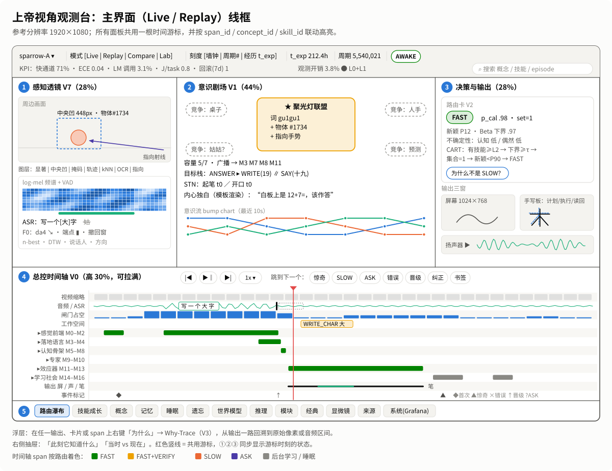
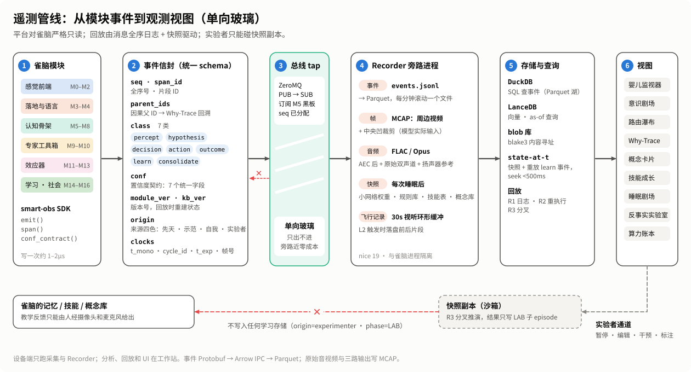
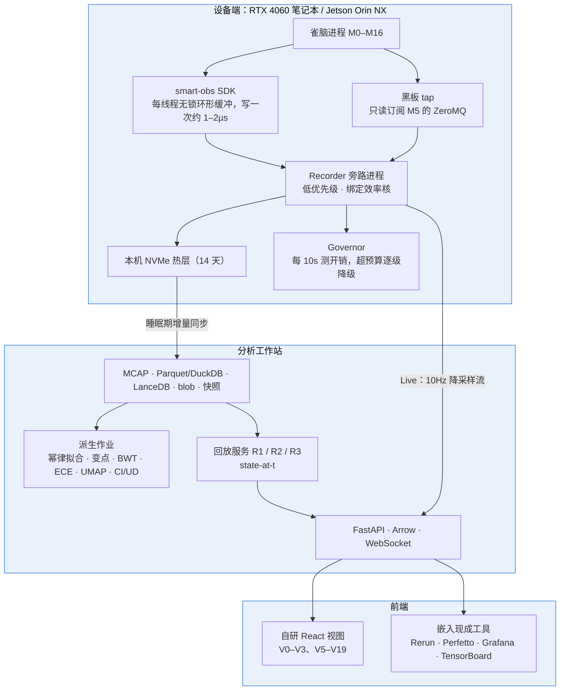

# 雀脑设计（三）：上帝视角观测平台

> 本系列介绍 SMART-Sparrow（雀脑）v1 的设计。这是第三篇：怎样造一个平台，让人随时看到雀脑此刻在想什么、学到了什么、是怎样学会的。在架构里它就是模块 M17。
>
> [设计文档目录](README.md) ｜ 上一篇：[← 雀脑 v1 综合架构](02-sparrow-architecture.md) ｜ 下一篇：[路线图与关键实验 →](04-roadmap-and-experiments.md)

---

## 一、平台要回答什么

可以把这个平台想象成三样东西的合体：**婴儿监视器**（实时看它在做什么）、**飞机的黑匣子**（事后逐帧回放）、**程序员的调试器**（点开任何一步看内部状态）。它要回答三个问题：

1. **它此刻在想什么？** 焦点是什么，谁在和它竞争，为什么走了快通道或慢通道。
2. **它学到了什么？** 会了哪些概念和技能，每样到了什么熟练程度，有没有忘掉旧的。
3. **它是怎样学会的？** 这条知识从哪几段经历、经过哪次“睡眠”长出来，后来被哪些输出用过。

雀脑的架构天生适合被观测：模块之间传递的消息本身就是人能读懂的东西，比如识别结果、符号、规则触发、路由决策；每个事件都带“因果父 ID”。平台只要在黑板上接一个只读的旁路，就能看清思路的流动。

## 二、设计原则

1. **旁路总线为骨架，模块内部用显微镜。** 主干是在 M5 黑板的 ZeroMQ 发布口上加一个只读 tap。需要细看时，才进入神经模块内部（探针、稀疏自编码器），或者看经典算法各自的“原生玻璃盒”（决策树路径、HMM 网格、DTW 对齐路径、卡尔曼椭圆）。
2. **在线记“原因”，离线补“结果”。** 常开记录的只有原始视听（包括模型实际看到的中央凹裁剪）、三路输出、带全序号的符号事件、版本号和少量低清镜像。Grad-CAM、TracIn 这类昂贵的解释放到工作站离线重算。回放靠“消息全序日志 + 定期快照”驱动，不靠“输入 + 随机种子”重新调度。
3. **一个事件模型，三根时间轴。** 所有模块共用一个信封；时间上同时用精确时钟、认知周期号和“经历时长”（它的“年龄”）对齐，另记相机帧号和音频采样号防止音视频漂移。所有视图共用一根游标，点任何对象，其它视图联动高亮。
4. **单向玻璃。** 平台对雀脑严格只读。人工标签、外部模型的转写、模板生成的内心独白都只存在观测侧；暂停、编辑、干预一律走实验者通道，只作用于快照副本，不写入任何学习存储。**教学反馈只能经摄像头和麦克风进入。**
5. **证据分级，如实标注。** 注意力图、相似度只标“假说/相关”；决策树路径、线性分解、规则变量绑定标“精确”；只有经实验室干预验证过的才标“因果”。心像类输出一律带“探针解释，非真值”角标。
6. **为可观测而设计。** 这是给架构组的接口契约：每个模块上线前必须声明它发出哪些事件、提供哪几级信号；清醒期写入全部追加式；梯度更新只在睡眠期做。
7. **“怎样学会”和“此刻在想什么”同样重要。** 晋级、概念生命周期、睡眠巩固、遗忘与回滚都做成可以拖动的时间线。“越熟越懂”量化为五组固定 KPI：更快、更准、更深、更省、更稳。
8. **观测有预算，降级看得见。** 常态开销不超过 5%，快通道关键路径上的同步开销不超过 2ms；自动降级时，时间轴上画一条“此段看不清”的灰带。观测不得改变行为。
9. **复用优先。** 底层用现成工具，只自研雀脑特有的视图；底层格式全部开放，任何查看器都能替换。
10. **隐私与可删除。** 默认本地存储；每个 episode 独立加密，删除时销毁密钥。

## 三、20 个视图

视图按优先级分四档：P0 是没有它就无法调试的“地基”，P3 是深挖研究用的。为避免与模块编号 M0–M18 混淆，平台的开发里程碑记作 PM0–PM6（见第十节）。

| 编号 | 视图 | 回答的问题 | 优先级 | 里程碑 |
|---|---|---|---|---|
| V0 | 经历录像机（婴儿监视器） | 任意时刻它看到、听到了什么，各模块何时做了什么，时间花在哪 | P0 | PM1 |
| V1 | 意识剧场 | 此刻焦点是什么，谁在竞争，为什么这个赢了 | P0 | PM2 |
| V2 | 路由与延迟瀑布 | 为什么走 FAST/SLOW/ASK，不确定性是“没见过”还是“看不清” | P0 | PM2 |
| V3 | 因果追踪与知识谱系 | 这一笔、这个音是哪块像素、哪段记忆、哪个版本的知识导致的 | P0 | PM2 / PM3 |
| V4 | 算力、能耗与观测开销账本 | 算力花在哪，每个任务耗多少焦耳，观测有没有拖慢它 | P0 | PM1 |
| V5 | 技能成长与概念生命周期 | 从第一次见到熟练用了几次，什么时候从慢想变成了快做 | P1 | PM3 |
| V6 | 概念卡片与知识图谱时间机器 | 学会了哪些概念，每个落地到了哪些模态，何时长出来的 | P1 | PM3 |
| V7 | 感知透镜 | 它在看哪里、用多高分辨率看，听出了什么，端点怎么判定 | P1 | PM4 |
| V8 | 成长档案首页 | 处在哪个发展阶段，最近学得快还是慢，下一步该教什么 | P1 | PM3 |
| V9 | 反事实与损伤实验室 | 如果看到的不一样会怎样，关掉某个模块还剩多少能力 | P1 | PM4 |
| V10 | 记忆回想与情景库 | 面对当前情境它想起了什么，哪些真正用上了 | P2 | PM5 |
| V11 | 睡眠剧场 | 睡觉时复习了什么，巩固出了什么，有没有回滚 | P2 | PM5 |
| V12 | 遗忘与保持 | 学了新的以后旧的忘了没有，干扰来自哪次学习 | P2 | PM5 |
| V13 | 预测与惊奇 | 它以为会发生什么，对什么感到意外，场景是否在适用范围内 | P2 | PM5 |
| V14 | 推理与规划检查器 | 慢通道里是怎么一步步推出来的，为什么放弃了其它分支 | P2 | PM5 |
| V15 | 模块脑图与可信度 | 哪些模块在工作，它的自信可不可信 | P2 | PM6 |
| V16 | 来源、先天固件与许可 | 哪些是学会的、哪些是写进去的，许可证允许怎样发布 | P2 | PM5 |
| V17 | 经典算法玻璃盒 | 决策树、HMM、DTW、卡尔曼等非神经组件此刻怎么判断 | P3 | PM6 |
| V18 | 神经显微镜 | 两端的小网络内部学到了什么特征，学习前后变了没有 | P3 | PM6 |
| V19 | 多个体与多实验对比 | 哪种配置学得更快、记得更牢、更省算力 | P3 | PM6 |

### P0：地基视图

**V0 经历录像机。** 类似视频剪辑软件加浏览器性能面板的多轨时间轴。轨道自上而下是：周边视频缩略帧（叠加中央凹窗口框）；波形、频谱和语音段，ASR 部分假设的修正过程（被撤回的部分用删除线），端点决策竖线及三个条件；闸门开合（注意力占空比）；工作空间胜出联盟；按六层分组的模块耗时泳道（FAST 绿、FAST+VERIFY 黄、SLOW 橙、ASK 紫、学习与睡眠灰）；记忆召回；想象与推理；三路输出（手写板笔迹以“计划、执行、读回”三重叠加）；事件标记（首次、惊奇、错误、晋级、ASK）。以 S1 为例，一眼能看出从话音结束到落笔的 0.35–0.6s 里，大头是端点检测和 ASR，路由决策不到 10ms。MVP 阶段直接用 Rerun Viewer 承载，音频页自研。

**V1 意识剧场。** 中央聚光灯卡片是当前周期胜出的联盟，例如 S2 里的“词 gu1gu1 + 物体 #1734 + 指向手势”；3–7 张竞争卡片环绕，角标显示容量占用和存活期。点击卡片看显著性分解（新颖度、目标相关度、置信度、紧迫度、社交、习惯化）。侧栏是目标栈（ANSWER ▸ WRITE(19) ∥ SAY(十九)）和三路输出排期。下方的“内心独白”由观测台按模板把焦点渲染成句子，例如“白板上是 12+7=，该作答”，固定标注“模板渲染，非系统输出”。

**V2 路由与延迟瀑布。** 单次决策卡列出置信度契约全部字段、不确定性类型、决策树路径高亮（路径本身就是精确解释），以及“最少改动哪个因素决策就会翻转”。慢通道部分显示各专家预测的成功率和耗时、效用排序、每个检查点上的计算价值曲线。聚合视图有四种动作比例的河流图、每周一行的延迟分布，以及一份“自信地犯错”清单：校准概率 > 0.9，但读回或社会反馈判为错的案例，每行都能跳到回放。

**V3 因果追踪与知识谱系。** 右键任一输出，从右（输出）到左（原始输入）展开溯源图：输出命令 ← 运动/语音计划 ← 工作空间胜出项 ← 规则、技能、记忆、事实 ← 感知识别（带共形集）← 原始像素框或音频区间。每条边标注证据级别。以 S4 为例：点手写的“9”，一路追到技能 digit_9 ← 答案 19 ← 竞速（事实表和精确算术都得 19）← Eq(Add(12,7)) ← 符号 7（共形集 {7}）← 白板像素框；点语音“十九”，经读数规则追到同一个结论节点。“知识谱系”模式则反过来，选中一个概念，看它的上游经历、睡眠会话、版本链，以及下游所有用过它的输出。

**V4 账本。** 按模块堆叠显示耗时、估算 GFLOPs/s、CPU/GPU 占用和功耗；每任务焦耳数和 LM 调用率随天数的变化；观测开销仪表（5% 和 10% 两条目标线）；观测开/关四种设置下 S1–S4 的延迟对比。直接做成 Grafana 仪表盘嵌入。

### P1：看见学习

- **V5 技能成长**：生命周期条（未见 → 初遇 → 名称绑定 → 首次成功 → L1 → L2 → L3 → 已巩固），降级和回滚用红色回退箭头；以练习次数为横轴的准确率、延迟、快通道率三条曲线，延迟同时拟合幂律和指数律并比较；变点检测标出“顿悟”时刻；算术策略（数数、精确计算、直接提取）的比例变化；“先懂后会”：离线探针准确率与行为准确率的时间差。S1 示例：写“大”第 1 次发出示范请求，第 3 次编译为 L1，第 20 次升到 L2。
- **V6 概念卡片与知识图谱**：概念卡展示落地束（照片域和线稿域原型墙、可播放的发音模板、写法和画法动画、属性、UD 分解、绑定证据如“指向 62%、互斥 20%、时间同步 11%、跨情境 7%”）；知识图谱带时间滑块回放生长过程，节点按落地模态数着色。
- **V7 感知透镜**：视频侧叠加显著性、中央凹窗口、物体档案与协方差椭圆、掩码、kNN 候选与开集阈值、指向射线、OCR 候选与共形集；音频侧显示 ASR 修正动画、声调轮廓、端点三条件、DTW 对齐路径、自听支路。
- **V8 成长档案首页**：顶部五组 KPI（更快：熟悉任务延迟 p50、快通道覆盖率；更准：平均共形集大小、ECE；更深：平均 UD、全落地概念数、部件复用率；更省：J/task、LM 调用率；更稳：BWT、已巩固比例、回滚次数），中部发展阶段泳道，右侧能力雷达，底部“最近发展区”表（只给老师参考，不推给雀脑）。
- **V9 反事实与损伤实验室**：选一个 episode 和分叉点，从快照恢复，施加干预（改识别结果、强制路由、隐藏记忆、禁用规则、降级技能、改物理参数），在沙箱里重跑下游并与原结果并排对比。S4 示例：把 7 改成 1，应该写 13、说“十三”；如果还是写 19，说明存在没被记录的旁路，这本身就是诊断结果。结果只写成 LAB 子 episode，**绝不写回主记忆**。

### P2 与 P3：深入与研究

- **V10 记忆回想**：当前线索与召回的 top-k 情景胶片条，含相似度分解和实际使用权重；记忆增长与冷热分层；激活衰减曲线（“遗忘”指想起来变慢）。
- **V11 睡眠剧场**：夜间七个阶段；重放栅格与优先级分解；每条目的损失前后对比；新规则、新抽象、合并与拆分；金丝雀回归表与回滚记录；CI 变化；用双重差分估计睡眠带来的收益。
- **V12 遗忘与保持**：技能 × 版本的保持率热力图；ACC、BWT、FWT 与遗忘量；“干扰嫌疑人”列表。例如检查学会“咕咕”之后，“小鸟”的原型有没有被拉偏。
- **V13 预测与惊奇**：预测幽灵轨迹叠在真实视频上；参数后验收敛过程；IMM 模式条；惊奇曲线；“交互边升为因果边”的干预证据。
- **V14 推理与规划检查器**：推导图（不确定性沿推理链传递）、事实提取与精确计算的竞速面板、HTN 分解树、搜索树、候选程序、语言模型的约束解析。
- **V15 模块脑图**：按六层固定布局的模块拓扑，节点显示激活强度、置信度、新颖度告警，展开可看可靠性图和共形覆盖率。这是“可信”的核心视图：让人看到它什么时候“不知道自己不知道”。
- **V16 来源与许可**：知识四色统计、先天固件清单（每条带版本号和消融结果）、组件许可证表与发布检查清单。
- **V17 经典算法玻璃盒**：每类算法用自己的原生解释模板，例如决策树路径、TreeSHAP 瀑布、Viterbi 路径、DTW 代价矩阵、卡尔曼三轨迹。
- **V18 神经显微镜**：线性探针热图、稀疏自编码器特征浏览、版本差分。先做小实验再决定投入。它也会如实显示“否定结果”：编码器冻结时，显微镜会告诉你“权重没有变化，增长发生在原型库、概念中枢和技能表”，这本身就回答了“学到的东西存在哪”。
- **V19 多个体对比**：同一个“童年”快照分出的不同配置个体，按经历时长对齐的学习曲线、掌握时间的生存曲线、同一探针上的“双胞胎回放”。

## 四、主界面线框

<p align="center">
  
</p>

主界面（Live / Replay 模式，参考分辨率 1920×1080）的布局：

| 区域 | 位置与大小 | 内容 |
|---|---|---|
| 顶栏 | 顶部 | 个体选择、模式切换（Live / Replay / Compare / Lab）、时间刻度（墙钟 / 周期号 / 经历时长）、当前相位（清醒或睡眠）；KPI 摘要与观测开销徽章（如“3.8% ● L0+L1”）；全局搜索 |
| ① 感知透镜 V7 | 左列，约 28% 宽 | 上半是画面与图层开关；下半是可播放的频谱、ASR 假设、声调与端点标注 |
| ② 意识剧场 V1 | 中列，约 44% 宽 | 聚光灯联盟、竞争卡片、容量与广播、目标栈、输出排期、内心独白、意识流排名条带 |
| ③ 决策与输出 | 右列，约 28% 宽 | 上半是路由决策卡 V2；下半是屏幕、手写板、扬声器三个输出窗 |
| ④ 总控时间轴 V0 | 下部，约 30% 高，可拉满 | 回放控制、“跳到下一个”按钮组（惊奇、SLOW、ASK、错误、晋级、纠正、书签），多轨泳道；游标竖线向上贯穿三列 |
| ⑤ 底部标签页 | 最下方 | 路由瀑布、技能成长、概念、记忆、睡眠、遗忘、世界模型、推理、模块、经典、显微镜、来源、系统 |
| 浮层与抽屉 | 按需 | 右键任一输出选“为什么”弹出因果追踪 V3；右侧抽屉“此刻它知道什么”和“当时 vs 现在” |

另有三个独立页面：**首页**是成长档案 V8；**实验室页**是全屏的 V9（左侧选 episode 和分叉点，中间是干预编辑器，右侧 A/B 同步播放，下方事件差异表）；**Compare 模式**把两个 episode 或两个版本上下分屏、共用一根游标。

部署上，设备端（笔记本或 Jetson）只跑采集和录制，不跑界面；界面在工作站浏览器打开，Live 模式通过局域网订阅 10Hz 降采样流。

## 五、遥测 schema

所有模块用同一个“信封”发布事件。核心设计决定：

| 要素 | 设计 |
|---|---|
| 事件分类 | 沿用架构的七类：percept（感知）、hypothesis（假设）、decision（决策）、action（动作）、outcome（结果）、learn（学习）、consolidate（巩固），另加 meta（耗时、统计、观测系统、实验者）。具体子类型约 60 种，全部登记在注册表里；用 Protobuf 定义，升级时只加字段 |
| 全序与因果 | seq 由黑板代理在发布时分配，是回放顺序的唯一依据；parent_ids 记录多个前驱，供因果追踪；trace_id / span_id 与 OpenTelemetry 兼容，但热路径不运行 OTel SDK |
| 时钟 | t_mono_ns（单调时钟）、cam_frame（相机帧号）、audio_sample（音频采样号）、cycle_id（10Hz 认知周期号）、t_exp_ms（累计清醒经历时长，即“年龄”）、t_wall、sleep_idx、train_step |
| 版本 | module_ver 是权重、规则库或树模型的内容 hash；kb_ver 把情景库位置、概念、技能、规则、路由器版本打成一包，用来重建“那一刻它知道什么” |
| 来源四色 | origin：innate（先天固件）、demo（示范习得）、self（自我发现）、experimenter（实验者注入） |
| 置信度契约 | conf：{p_cal, set_size, novelty_pct, margin, est_cost_ms, epistemic, aleatoric}，没有的字段留空 |
| 相位 | phase：AWAKE、MICROSLEEP、SLEEP、PROBE（在分叉副本上冻结评测）、REPLAY、LAB |
| 大对象 | 张量、帧、音频一律用引用：`b3:` 表示内容寻址的 blob，`mcap:` 表示录像文件里的一段时间区间 |

一个信封示例（S1“写一个大字”命中 L2 技能时的路由决策，节选主要字段）：

```json
{
  "schema_ver": 1,
  "seq": 918273,
  "agent_id": "sparrow-A",
  "episode_id": "ep-0924-0412",
  "cycle_id": 5540021,
  "trace_id": "tr-0924-0412-0007",
  "span_id": 88121,
  "parent_ids": [88117, 88119],
  "clocks": {"t_mono_ns": 81234567890123, "cam_frame": 55123, "audio_sample": 1974528,
             "t_exp_ms": 764640000, "sleep_idx": 57},
  "phase": "AWAKE",
  "module": "M6.router",
  "module_ver": "cart:b3e1f09a",
  "kb_ver": {"mem_lsn": 1203344, "concept_ver": 8812, "skill_ver": 4410,
             "rule_ver": 219, "router_ver": "retrained-s57"},
  "class": "decision",
  "kind": "route.decision",
  "origin": "self",
  "tier": "L1",
  "conf": {"p_cal": 0.98, "set_size": 1, "novelty_pct": 12, "margin": 0.91,
           "est_cost_ms": 4, "epistemic": 0.03, "aleatoric": 0.01},
  "payload": {
    "task_key": ["WRITE_CHAR", "da4", "pad"],
    "skill_id": "sk-write-da4",
    "skill_level": "L2",
    "features": {"cms_count": 412, "beta_lcb95": 0.97},
    "uncertainty_type": "none",
    "decision": "FAST",
    "tree_path": [0, 1, 4, 9, 19],
    "decide_us": 180
  }
}
```

再看一个 S2 的词-物绑定事件（只列与上例不同的关键字段）：来源是 `demo`（示范习得），`payload` 里有词的主键 `{"pinyin": "gu1gu1", "asr_nbest": ["咕咕", "姑姑"]}`、指称对象 `track_id: 1734`、后验 0.93（阈值 0.8），以及证据分解 `{"pointing": 0.62, "mutual_exclusivity": 0.20, "temporal_sync": 0.11, "cross_situational": 0.07}`，动作是新建概念。

**事件目录（节选）**

| 类 | 子类型举例 |
|---|---|
| percept | gate.wake、fovea.select、track.update、recog.knn、openset.judge、ocr.cand、pointing.ray、asr.partial、endpoint.decide、f0.contour、dtw.match |
| hypothesis | ws.bid、binding.update、fact.assert、parse.result、mem.query、prediction.made、phys.posterior |
| decision | ws.broadcast、route.decision、algo.select、anytime.checkpoint、goal.push、stn.plan、ask.issue、retract |
| action | action.emit（通道：笔、屏、声）、motor.plan、render.plan、speech.plan |
| outcome | readback、selfhear、reward、error.attrib、repair、surprise、shadow_check、race、probe.result、lm.call |
| learn | mem.write、concept.upsert、kg.edge、skill.compile、skill.promote、skill.demote、beta.update、phys.update、edge.promote |
| consolidate | sleep.session、sleep.replay、hdbscan.merge/split、distill.job、stitch.abstraction、param.update、canary.result、rollback、lesion.ci |
| meta | span.start/end、module.stat、tree.decision、hmm.decode、dtw.align、kalman.step、obs.governor、obs.drop、bookmark、intervention |

**分级记录**

| 级别 | 何时记录 | 内容 | 数据量 |
|---|---|---|---|
| L0 | 常开 | 计数器、直方图、仪表 | 约 ≤ 5 KB/s |
| L1 | 常开 | 全部符号事件；原始音视频、中央凹裁剪、三路输出；低清镜像（显著性 32×32、注意力 16×16、活跃轨迹嵌入 1–2Hz） | 不含媒体约 0.1–0.3 MB/s |
| L2 | 触发式 | 首次遇见、新颖度 > P95、惊奇超阈值、错误或纠正、快转慢、ASK、慢通道超过 2s、金丝雀失败、人工书签、1% 随机抽样；落盘触发前 10–30s、后 5–10s | 按分钟限次 |
| L3 | 离线重算 | 在工作站或睡眠空闲期执行，不占在线算力 | — |

**三种回放**

- **R1 日志重放**：直接渲染记录下的消息和输出，不做任何重算，保真度 100%。V0–V3 默认用它。
- **R2 模块级重执行**：以模块边界上的消息和原始输入为输入、以当时的模块版本为状态，重算注意力、Grad-CAM、探针等内部量；必须报告重算与记录的一致率。
- **R3 分叉推演**：从快照加日志恢复到分叉点，下游实时运行并施加干预，结果写成 LAB 子 episode。

“那一刻它知道什么”（state-at-t）靠“最近快照 + 按序重放之后的学习事件”重建，目标是 500ms 内定位到任意时刻。

**存储与保留**：原始音视频和输出存 MCAP（按 zstd 分块，每 10 分钟一个文件）；事件经 Arrow 写成 Parquet，用 DuckDB 查询；向量存 LanceDB（模型一更新就算新空间）；blob 内容寻址。单个体清醒期约 0.75–1.1 GB/小时，每天清醒 8 小时约 6–9GB；热层保留 14 天全量（约 90–125GB，放本机 NVMe），冷层永久保留全部事件和关键媒体片段，每个体每年约 250–500GB。手写板的数字回显只存到观测侧通道 `/obs/pen_echo`，**绝不回流给雀脑**。

## 六、平台架构

<p align="center">
  
</p>



四种模式的数据路径：**Live** 只显示 L0/L1，遇到 L2 触发就在时间轴上打书签；**Replay** 按时间区间取数据走 R1，需要内部量时提交 R2 作业再回填；**Compare** 取两个 episode 或两个版本按经历时长或练习次数对齐；**Lab** 通过 R3 分叉推演。

**单向玻璃怎样强制执行**

1. 雀脑运行时不 import 任何平台包，由 CI 静态检查。
2. 平台服务以独立的系统用户运行，对雀脑的记忆库、技能库、概念库只有只读挂载。
3. 实验者的暂停、编辑、干预、标注只作用于快照副本，事件标为 origin=experimenter、phase=LAB。
4. 外部模型生成的转写和特征命名只存在观测侧。
5. 教学反馈必须由人通过摄像头和麦克风给出。

**给架构组的接口约定**：每个模块上线前提交一份“信号声明”（它发出哪些事件、属于哪一级），作为合并请求的必备项；路由器保持决策树，显著性排序器保持线性或 LightGBM；所有知识写入带出处和来源色；清醒期写入全部追加式，参数更新只在睡眠期。

**超轻配置**：Jetson Orin Nano 没有硬件视频编码器（NVENC），周边视频降到 640×360@10fps 软件编码，或只编码触发片段；低清镜像降到 1Hz；R2/R3 全部在工作站执行。

## 七、工具选型

| 用途 | 工具 | 说明 |
|---|---|---|
| 多模态同步回放（V0 初版） | Rerun | 支持多条时间线、视频、笔迹、标量、文本。已核实两点限制：原生音频播放的功能请求仍未关闭，按不支持处理，音频面板用 wavesurfer.js 自研；web-viewer 0.37.x 的 wasm 构建缺少 MCAP importer，所以先在服务端把 MCAP 转成 .rrd |
| 黑匣子容器 | MCAP | 自带索引、可 seek |
| 无前端时查看数据 | Lichtblick（Foxglove Studio 的社区分叉） | 可自托管；Foxglove 本身采用开放核心模式，只作可选项 |
| 黑板旁路与实时流 | ZeroMQ | 架构已选定它做黑板总线 |
| 事件格式与查询 | Protobuf + Arrow + Parquet + DuckDB | 单机免运维；多个体长期运行时换 ClickHouse |
| 向量与原型版本 | LanceDB | 借助表版本做“截至某时刻”的查询 |
| 知识图谱 | DuckDB 边表 + NetworkX | 不选 Kùzu：该仓库已于 2025 年 10 月归档 |
| 系统指标与告警 | Prometheus + Grafana | V4 直接用 Grafana 实现 |
| 性能剖析 | Perfetto + torch.profiler | 深挖耗时瀑布 |
| 树模型解释 | LightGBM pred_contrib + SHAP、dtreeviz、DiCE | 精确分解和最小翻转反事实 |
| 神经归因与显微镜 | Captum、nnsight、ViT-Prisma、SAELens、pyvene | 全部走离线重算 |
| 学习动态分析 | umap-learn（AlignedUMAP）、ruptures、lifelines、pyBKT、py-fsrs | 概念地图、顿悟变点、掌握时间、观测侧的掌握概率与保持预测 |
| 持续学习指标 | Avalanche | 作为 ACC/BWT/FWT 的定义参考 |
| 训练曲线 | TensorBoard / MLflow | 睡眠期小网络训练 |
| 观测侧标注 | Label Studio | 标签只保存在平台侧，严禁回流 |
| 自研前端 | React + TypeScript、D3、uPlot、deck.gl、Cytoscape.js、wavesurfer.js、WebCodecs | 时间轴、瀑布图、知识图谱、波形与频谱、帧精确定位 |

## 八、开销控制

**预算**：常态（L0+L1）端到端开销 ≤ 5%；S1 快通道端到端约 0.35s，所以关键路径上的同步开销 ≤ 2ms；短时触发 L2 时 ≤ 10%；内存增量约 150MB 以内；L3 不占在线算力。

**主要手段**：

1. **优先记录本来就有的数据。** 路由特征、决策树路径、kNN 距离、共形集、规则触发、卡尔曼状态，模块本来就在算，观测只是顺手记下来。
2. **热路径只做一件事**：把固定结构写进每线程的无锁环形缓冲，每次约 1–2µs。清醒期平均约 400 条事件/秒、峰值 2000 条/秒，合计每秒不超过 4ms CPU。序列化、压缩、落盘全交给低优先级的 Recorder 旁路进程。
3. **GPU 上不引入同步点。** 张量摘要直接在 GPU 上算，只拷回几十个标量；热路径禁止同步读取。
4. **昂贵的计算只在触发时或离线做。** 因为录下了中央凹裁剪和模块边界消息，不需要在线保存全量激活。
5. **媒体编码是开销大头。** 有硬件编码器的设备用硬件编码；没有的（如 Orin Nano、纯 CPU）降分辨率软编码或只编码触发片段。
6. **飞行记录仪不复制数据**：只读映射 M0 已有的 30 秒视听缓冲，另加一个 10 秒激活缓冲。
7. **背压与丢弃顺序**：缓冲满时按 L2 → 低清镜像 → 嵌入 → 视频帧率的顺序丢弃；符号事件、三路输出、回声消除后的音频和黑板消息日志**永不丢弃**，它们是回放的前提。
8. **Governor 闭环**：每 10 秒测一次开销，超过 5% 就逐级降级，恢复后逐级回升，时间轴上用灰带标出。
9. **验证观测不改变行为**：CI 用 S1–S4 的录制输入跑“观测关闭 / L0 / L0+L1 / +L2”四种设置，断言三路输出一致、快通道延迟差 < 5%，在 Orin NX 和 RTX 4060 笔记本上各出一份报告。

## 九、隐私与伦理

常开的摄像头和麦克风会录到老师、孩子等真人，而“事件只追加”的设计与“被遗忘权”天然存在冲突。平台的处理方式：

- **默认只在本地存储**，冷层对人脸和声纹做脱敏。
- **每个 episode 使用独立的加密密钥**。收到删除请求时销毁对应密钥（crypto-shredding），事件日志里只留一个墓碑标记，这样既能真正删除内容，事件溯源的链条也不会断。
- 配合架构中“每条知识都有出处”的设计，可以按出处精确删除某人的数据及其衍生知识。
- 这些措施从平台第一个里程碑就开始执行；删除和保留期限的审批流程与 SMART 的“可信”原则一起制定。

## 十、MVP 路线

| 里程碑 | 时间 | 内容 | 验收 |
|---|---|---|---|
| PM0 契约先行 | 第 0–2 周 | 定稿 schema v0；实现 smart-obs SDK；把“信号声明”写进模块接口规范；接好黑板 tap；Recorder 写 MCAP 和 Parquet；建立 S1–S4 固定探针套件 v0（每类 20–50 题）；CI 加入开销 A/B | 观测开/关时三路输出一致；关键路径同步开销 < 2ms，端到端增量 < 5% |
| PM1 先让人看得见 | 第 3–5 周 | V0 初版（Rerun 承载，音频页自研）；导出 Perfetto trace；V4 用 Grafana 实现 | S1 能逐帧回放，看清 0.35–0.6s 的构成 |
| PM2 认知骨架 | 第 6–9 周 | V2 路由卡与瀑布；V1 意识剧场 v0；V3 决策溯源 v0 | 用 S4 验收：点手写的“9”能追回白板像素框；“十九”和“19”共用同一个结论节点 |
| PM3 让学习过程可见 | 第 10–13 周 | 离线作业（幂律拟合、变点、BWT、UD/CI 汇总）；state-at-t 服务；V5、V6、V8 | S1 看到“大”从示范请求到 L1、L2 的完整晋级时间线；S2 看到“咕咕”概念诞生并能回溯到两次命名 |
| PM4 感知与因果验证 | 第 14–17 周 | V7 感知透镜 + R2 离线补算；V9 实验室 v0（消息级干预） | S4 把 7 改成 1 后写 13、说“十三”，差异表完整 |
| PM5 记忆、睡眠、遗忘与世界模型 | 第 18–23 周 | V10、V11、V12、V13、V14、V16 | 能量化一次睡眠的收益；能回答“咕咕的原型由哪几段经历、哪次睡眠塑造”；S3 调大阻力后预测的球停在坡中段 |
| PM6 深挖与规模化 | 第 24 周起 | V15、V17、V18（先做小实验）、V19；按需迁移到 ClickHouse | — |

贯穿全程：观测 SDK 是模块接口规范的一部分，没有信号声明的模块不得合并；开销 A/B 和单向玻璃检查纳入每次 CI；隐私措施从 PM0 开始执行。

## 十一、主要风险

| 风险 | 缓解 |
|---|---|
| 观测者效应，开销超标拖慢快通道 | Governor 自动降级并显示灰带；热路径禁止同步点；CI 开/关对比超预算就阻止合并 |
| 回放不一致 | 采用“消息全序日志 + 快照”；R1 保真度 100%，R2/R3 必须报告一致率 |
| 单向玻璃被破坏，人工标注回流 | 进程隔离、只读挂载、来源四色、CI 静态检查 |
| 解释被误读（注意力不等于解释，模板独白被当成自述） | 证据分三级；心像类输出带角标和重建误差；关键结论必须经干预验证才标为因果 |
| 神经可解释性工具收益有限（编码器冻结、维度小） | 优先用黑板消息和原生玻璃盒解释；V18 放在 P3，先做小实验 |
| 概念 ID 因合并与拆分而不稳定 | 定义 ID 继承规则，建谱系表，按谱系聚合 |
| 评测本身变成学习 | 所有探针在分叉副本上运行，测验频率设上限 |
| 工程量失控 | 严格按 P0 到 P3 推进，底层尽量复用，每个里程碑绑定一个 S1–S4 场景验收 |

---

👉 下一篇：[雀脑设计（四）：路线图与关键实验](04-roadmap-and-experiments.md)
