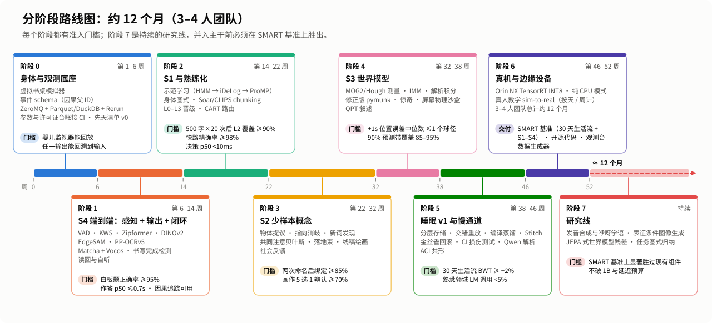
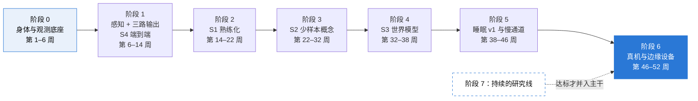

# 雀脑设计（四）：路线图与关键实验

> 本系列介绍 SMART-Sparrow（雀脑）v1 的设计。这是第四篇：按什么顺序把它做出来，用哪些实验检验设计是否成立，还有哪些问题没解决，以及你可以怎样参与。
>
> [设计文档目录](README.md) ｜ 上一篇：[← 上帝视角观测平台](03-god-view-platform.md)

---

## 一、总体节奏

  

按 3–4 人的团队估算，主体开发约需 **12 个月**。五份候选方案原本大多按 6 个月规划，核查认为偏乐观（发声学习、中文无监督词发现等都有研究风险，sim-to-real 也被低估），所以放宽到 12 个月。

排序遵循三条原则：

1. **观测先行。** 身体和观测底座在第一阶段就搭好，之后每加一个能力，都要能在平台上看见、回放、追溯。
2. **从最确定的场景开始。** S4（白板算术）端到端最确定：感知、解析、计算、输出都有成熟方案，适合先把整条管线跑通。然后是 S1（熟练化）、S2（新概念）、S3（物理预测），最后是睡眠巩固和慢通道。
3. **每个阶段都有准入门槛。** 门槛是量化的，达不到就不进入下一阶段。

## 二、分阶段路线图

| 阶段 | 时间 | 主要内容 | 准入门槛 |
|---|---|---|---|
| **0 身体与观测底座** | 第 1–6 周 | ① 虚拟书桌模拟器：渲染桌面、白板、带屏手写板和显示屏，摄像头要能看到后两者；虚拟照料者由多说话人 TTS 驱动，并加变声和混响增强；用 Make Me a Hanzi 渲染书写视频。② 带因果父 ID 的事件 schema。③ ZeroMQ + Parquet/DuckDB + Rerun，另自研音频面板。④ 参数台账和许可证台账接入 CI：总参数超过 1B，或出现 GPL/AGPL/非商用组件，就自动告警。⑤ 先天固件清单 v0 | 婴儿监视器能回放；在合成场景里能从任一输出回溯到输入 |
| **1 感知 + 三路输出，S4 端到端** | 第 6–14 周 | 感知：Silero VAD、中文关键词检测、流式 Zipformer、DINOv2、EdgeSAM 关键帧、MediaPipe Tasks、PP-OCRv5、符号 CNN。处理：Lark 解析、精确算术、数字读法规则。输出：Matcha-zh + Vocos 加波形缓存；手写板用 sigma-lognormal 数字程序。闭环：书写完成检测器、摄像头读回、麦克风自听 | 真实白板题目正确率 ≥95%；完成判定后作答 p50 ≤0.7s；因果追踪视图可用 |
| **2 S1 与熟练化** | 第 14–22 周 | 示范学习管线（笔尖跟踪 → HMM 分段 → iDeLog → ProMP）；身体图式自标定；HCCR 读回；Soar/CLIPS 技能缓存与 chunking；L0–L3 晋级规则；约 30 条先天规则构成的路由决策树与置信度契约 | 500 个常用字每字练 20 次后，L2 覆盖率 ≥90%，快路精确率 ≥98%，决策 p50 <10ms；练习曲线视图上线 |
| **3 S2 少样本概念** | 第 22–32 周 | 类别无关物体提议、指向消歧、segmental DTW 新词发现、以拼音加声学模板为主键的词库、共同注意贝叶斯闭式解、概念中枢与落地束、线稿网络加部件程序绘画、话语脚本、社会反馈检测器（反馈词、韵律、笑脸、点头） | 两次命名后绑定准确率 ≥85%；人评 5 选 1 时画作有 ≥70% 能被认出 |
| **4 S3 世界模型** | 第 32–38 周 | 团块与 Hough 精确测量、IMM、侧视检查、像素空间拟合、NumPy 解析积分、修正过的 pymunk、多假设精灵渲染、惊奇信号、屏幕物理沙盒、定性物理叙述 | +1s 位置误差中位数 ≤1 个球直径；90% 预测带的覆盖率在 85–95% 之间 |
| **5 睡眠 v1 与慢通道** | 第 38–46 周 | 情景记忆分层存储、交错重放、编译与蒸馏、Stitch 限时库学习、金丝雀回滚、海马损伤测试、BCT（仅在启用 LoRA 时）、Qwen2.5-0.5B 语义解析与蒸馏、ACI 共形、经验性能模型与影子运行 | 30 天模拟生活流中 BWT ≥ −2%；熟悉领域 LM 调用率降到 5% 以下 |
| **6 真机与边缘设备** | 第 46–52 周 | Orin NX 上用 TensorRT INT8，笔记本跑纯 CPU 模式；安排若干天真人教学做 sim-to-real，预算按天或周计，不按小时计；搭建 SMART 基准；开源代码、观测台和数据生成器 | 暂未单列量化门槛，以 SMART 基准上的真机实测结果为准 |
| **7 研究线（持续）** | 并行 | 发音合成与咿呀学语（VocalTractLab / SPARC）；以表征为条件的图像生成；SlotFormer / JEPA 式世界模型残差；从示范中归纳任务图式；在更底层的原语上学习算术 | 任何一条线要并入主干，都必须在 SMART 基准上显著优于现有组件，而且不突破 1B 参数预算和延迟预算 |

观测平台的开发里程碑（PM0–PM6）与主体阶段并行推进，详见[第三篇第十节](03-god-view-platform.md#十mvp-路线)。两条线共同的规矩是：每个里程碑都绑定一个 S1–S4 场景作为验收。

**与实现仓库的对应**：[SMART-SPARROW](https://github.com/SMART-GAI/SMART-SPARROW) 的 v0.1 以“模拟托儿所 + 经典算法 MVP”的方式实现，与这里阶段 0 的思路一致：先在模拟环境中用经典算法把闭环跑通。具体实现范围和进度以该仓库为准。

## 三、关键实验

设计里的每个核心论点，都要有实验来检验。下面 12 个实验既是验收标准，也是“这条路线对不对”的证据来源。

| 编号 | 验证什么 | 实验设置 | 指标与目标 |
|---|---|---|---|
| **E1 练习曲线** | S1；熟悉任务要快；越练越快 | 500 个常用字，每字练 50 次，记录决策时延和端到端时延，同时拟合幂律和指数律 | N≥20 时决策 p50 <10ms；L2 覆盖率 ≥90%；快路精确率 ≥98%；端到端 p50 GPU ≤0.6s、CPU ≤0.9s；HCCR 读回可读率 ≥97%；人评外部可读率 ≥95% |
| **E2 一次/少样本概念** | S2 | 50 个新玩具 × 3 位教学者，每个场景放 2–4 个干扰物，加入同音干扰（姑姑 / 咕咕） | 两次命名后绑定准确率 ≥85%；睡过一夜后跨模态 recall@1（听到名字找到物体）≥90%；画作 5 选 1 辨认率 ≥70%；7 天后延迟回忆 ≥80%；误绑定率 ≤5%；统计单视角时发出 ASK 的比例 |
| **E3 物理预测** | S3 | 自建侧视斜坡数据集，合成视频与真实桌面视频共 300 段 | +1s 位置误差中位数 ≤1 个球直径；90% 预测带经验覆盖率 85–95%；期望违背惊奇 AUC ≥0.9；同一个球观察 5 次后预测误差下降 ≥30%；触发到首帧 ≤0.3s；非侧视场景被正确判为超出适用范围的比例 |
| **E4 符号推理** | S4 | 1000 道真实白板题，20 名书写者 | 端到端正确率 ≥97%；完成判定到开始作答 p50 ≤0.7s；未写完就提前作答的次数为 0；错误按感知、推理、执行三类归因；共形集大于 1 时的 ASK 率及 ASK 之后的正确率 |
| **E5 30 天持续学习** | 越熟越懂；不遗忘 | 生活流：每天新增 5 个概念、20 个字和若干物理场景 | ACC；BWT ≥ −2%；FWT > 0；新概念 3 夜内 CI ≥0.9 的比例；金丝雀回滚频率；LM 调用率从 >30% 降到 <5%；J/task 逐日下降 |
| **E6 路由与校准** | 元认知可信 | 全部场景的路由日志 | ECE ≤0.05；ACI 共形覆盖误差在 ±2% 以内；误路由率（快路答错而慢路答对）≤1%；ASK 率随熟悉度上升而下降；影子运行补齐反事实标签后路由树的效用提升 |
| **E7 损伤与消融** | 每个部件都必要；量化先天知识的贡献 | 分别关闭海马检索、快通道、睡眠巩固、符号工具、**先天固件包**、真实感官闭环（改用内部渲染） | 四个场景上准确率、时延和学习速度的变化 |
| **E8 端到端基线对照** | “有机组合”这一核心论点 | 在同样约 0.7B 的预算内，用 DINOv2 + Qwen2.5-0.5B + TTS 拼成端到端管线，经 LoRA 训练后跑同一套基准 | 对比准确率、少样本效率、J/task、熟悉任务时延和 BWT |
| **E9 算力与能耗** | 预算表里的估算值 | 在 Orin NX 和笔记本上实测 | 空闲与活跃时的 GFLOPs/s；功耗（Orin NX 目标 ≤20W）；每个模块的毫秒/焦耳账本；冷加载时延 |
| **E10 可观测性审计** | 上帝视角是否名副其实 | 全部场景的观测数据 | 因果追踪完整率 100%；消息日志回放一致率；记录开销 ≤5% CPU；研究者仅凭意识剧场预测下一步动作的准确率；来源四色标注与人工核查的一致率 |
| **E11 自检有效性与防循环** | 自我验证不是“自己骗自己” | 对比自检分数与人评；逐步增加自产数据 | 自检分数与人评的相关系数 ≥0.8；随自产数据增加，外部锚数据上的读回识别率不下降；只用自检更新时技能后验的虚高幅度 |
| **E12 端点权衡** | 快与误触发的平衡 | 调节语音端点参数 | 绘制误触发率与端点时延曲线，目标是误触发率 ≤1% 时端点时延 ≤400ms；撤回窗口能拦下多少误触发；FAST+VERIFY 纠错时划掉重写的频率 |

其中三个实验对“诚实”尤其关键：

- **E7 消融**回答“它会的东西里，有多少是出厂写进去的”。如果去掉先天固件包后能力大幅下降，我们会如实报告。
- **E8 对照**回答“费这么大劲做有机组合，到底值不值”。五份候选方案都没有对照组，这是评审指出的共同缺口。如果同等预算的端到端拼装在主要指标上不输，设计就需要重新考虑。
- **E11 防循环**回答“用自己的眼睛检查自己的输出，会不会越查越自信却越来越错”。

## 四、统一评测：SMART 基准与纵向指标

目前没有一个从**原始视听输入**到**笔、声、屏输出**的标准基准，“越熟越懂”也无法用一次性测验衡量。所以我们自建 **SMART 基准**：

- **30 天生活流**：模拟连续多日的“托儿所”生活，每天有新概念、新字、新物理场景，也有旧内容的复现。
- **S1–S4 固定探针套件**：每类 20–50 题起步，版本化管理。
- **纵向指标**：

| 指标 | 含义 |
|---|---|
| 练习曲线 | 延迟随练习次数的变化，同时拟合幂律 T = a·n^(−b) + c 和指数律并比较 |
| 快通道覆盖率 / 精确率 | 有多少任务走快通道，快通道做对的比例 |
| ACC / BWT / FWT | 平均准确率、向后迁移（学新的对旧的影响，负值即遗忘）、向前迁移（按 Lopez-Paz & Ranzato 2017 的定义） |
| CI 巩固指数 | 关闭海马检索时的准确率 ÷ 开启时的准确率 |
| UD 理解深度 | 落地模态数、知识图谱度、关联技能数、预测误差、成功次数、CI 的加权和 |
| ECE / 共形覆盖 | 置信度校准误差；共形集的经验覆盖率与目标值之差 |
| J/task、LM 调用率 | 每任务能耗；语言模型兜底的调用比例 |
| 跨模态 recall@1 | 听到名字能否找到对应物体 |

评测规则：所有探针都在**分叉副本**上运行，避免“考试本身变成一次学习”；KPI 定义版本化，首页固定一组；对比“谁学得快”时，经历时长、练习次数、GPU·小时三种对齐方式都可切换，默认用经历时长。

## 五、风险与待解问题

### 研究风险：可能做不出来

| 问题 | 现状与对策 |
|---|---|
| 从咿呀学出可懂、带声调的普通话 | 开放研究问题。主干默认用预训练 TTS（在先天清单中声明），发声学习放在研究线 |
| 无监督切分中文口语词 | 开放研究问题。主干用 ASR 候选 + 拼音 + 声学模板的双轨方案 |
| “有机组合更省、更懂”不成立 | 由 E8 检验；如果不成立，如实修改设计 |
| 目标从哪里来 | 目前依赖先天句式种子；从示范中归纳任务图式列为研究线 |
| 小型生成器一次学会新概念并生成新视角 | 不承诺；图像生成只作研究预留（≤100M） |

### 工程风险

- **实时系统工程**：统一时钟、传感器与执行器时延标定、多模型优先级调度、按需模型冷加载（0.2–1s）、Python GIL 抖动，这些要进入延迟预算。建议实时编排用 C++/Rust 核心或常驻的 ONNX Runtime 会话。
- **数字偏乐观**：所有 FLOPs 和延迟都是估算，由 E9 逐项核对。
- **端点与误触发**：激进的端点会截断句中停顿、造成误触发，由 E12 找平衡点。
- **sim-to-real**：真人教学的预算按天或周计。
- **集成复杂度**：19 个模块、多种数据结构、多时间尺度调度。缓解方式是模块接口规范、信号声明和每阶段的场景验收。

### 设计上的开放问题

- **多人场景与受话人判定**：几个人同时在场时，谁在对它说话、该听谁的、谁的纠正优先，目前只有说话人区分和粗定向，没有完整方案。
- **轮流说话与被打断**：何时开口、自己说话时被打断怎么办，只有回声消除和自听这一前提，策略待设计。
- **编码器的领域漂移**：白板照片、真人笔迹、本人口音与预训练数据不同；主干冻结后只能靠个性化样例和小头适配，需要在锚点集上用 CKA 和线性探针持续监测。
- **快通道“熟练地犯错”**：错误技能一旦编译会被高频重复；依靠试用期、影子运行和降级，效果待 E6 验证。
- **奖励稀疏与信用分配**：主要靠自检和少量人类反馈，复杂任务里难以判断哪一步出错。
- **情景检索的规模化**：情景到百万级后，近邻检索会出现 hubness，相似情景互相干扰。
- **安全约束**：自学出的规则要受哪些硬约束，还没有落到模块上。

### 许可与合规

| 组件或数据 | 许可情况 | 处理 |
|---|---|---|
| CASIA-HWDB / OLHWDB | 仅限研究，需申请授权 | 发布权重前换用其他数据 |
| Baker（标贝）TTS 数据、WenetSpeech | 非商用 | 开源发布时自录“自己的嗓音”或用许可合适的数据重训 |
| Potrace | GPL | 隔离成可选插件 |
| YOLOv8 | AGPL | 不用，改用 Apache-2.0 的检测器 |
| Make Me a Hanzi | LGPL-3.0 + Arphic Public License | 只作可选先天包，单独着色 |
| EdgeSAM、照片→线稿网络 | 待核实 | 发布前核实 |

许可证台账由 CI 自动检查，出现 GPL/AGPL/非商用组件就告警。

### 待核实清单

- 物体提议检测器（YOLOX-Nano / NanoDet / PP-PicoDet）的参数量和算力。
- MediaPipe Tasks 各 Landmarker 的参数量。
- EdgeSAM 和线稿网络的许可证。
- iceoryx2 Python 绑定的成熟度（观测平台可选组件）。
- 预算表里全部算力和延迟估算（由 E9 实测）。

## 六、如何参与

雀脑是社区驱动的开源项目。不管你擅长哪个方向，都有可以动手的地方：

| 方向 | 你可以做什么 | 相关模块 |
|---|---|---|
| 感知前端 | 编码器集成与量化、中央凹策略、语音端点实验（E12） | M0–M2 |
| 落地与语言 | 共同注意模型、句式语法、语言模型解析与蒸馏 | M3–M4 |
| 认知骨架 | Soar/CLIPS 集成、路由决策树、L0–L3 晋级、情景库 | M5–M8 |
| 专家工具箱 | 符号推理与规划、物理测量与预测 | M9–M10 |
| 效应器 | 笔迹示范学习、线稿绘画、TTS 与读数规则 | M11–M13 |
| 学习与巩固 | 社会反馈检测、好奇心调度、睡眠巩固流水线 | M14–M16 |
| 观测平台 | SDK、Recorder、前端视图 | M17 |
| 模拟器与数据 | 虚拟书桌、虚拟照料者、探针套件 | 阶段 0 |
| 评测与实验 | E1–E12 的设计与执行，尤其是 E8 基线对照 | 第三节 |
| 文档与科普 | 改进本系列文档、补充图示、翻译 | 本目录 |

**贡献时请遵守这几条规矩**（它们直接来自设计中的硬约束）：

1. **信号声明**：新模块必须声明它发出哪些观测事件、属于哪一级，没有信号声明的模块不合并。
2. **参数预算**：神经参数总量由 CI 自动核算，不得超过 1B。
3. **许可合规**：主干不引入 GPL、AGPL 或非商用许可的组件；这类组件只能作为隔离的可选插件。
4. **先天知识必须登记**：任何没有经过“看”或“听”就进入系统的知识（规则、词典、预训练标签空间），都要登记进先天固件清单（M18），来源标为 innate。
5. **单向玻璃**：雀脑运行时不得 import 观测平台的任何包；平台上的人工标注和干预不得回流到学习数据。
6. **数字口径**：FLOPs 和 MACs 分开写；报告延迟时把端点等待和认知计算分开；估算值标明“待实测”。
7. **研究线并入主干**：必须在 SMART 基准上显著优于现有组件，而且不突破参数和延迟预算。

**从哪里开始**：

- 对设计有疑问、建议或发现错误，在本仓库（[SMART-GAI/.github](https://github.com/SMART-GAI/.github)）提 Issue 或 Pull Request。
- 想写代码，前往实现仓库 [SMART-SPARROW](https://github.com/SMART-GAI/SMART-SPARROW)。
- 想先了解背景，可以读我们的[通用人工智能科普系列](../blog/README.md)。

---

## 结语

“麻雀虽小，五脏俱全。”雀脑想证明的不是“小模型也能做大模型的事”，而是另一件事：**一个会看、会听、会写、会画、会说的小系统，可以越用越熟练、越用越懂，而且它的每一步都能被人看清。**

这条路上还有很多未知。我们把已知的数字、已知的局限和尚未回答的问题都写在这里，欢迎你一起来补全它。

👉 回到[设计文档目录](README.md)
