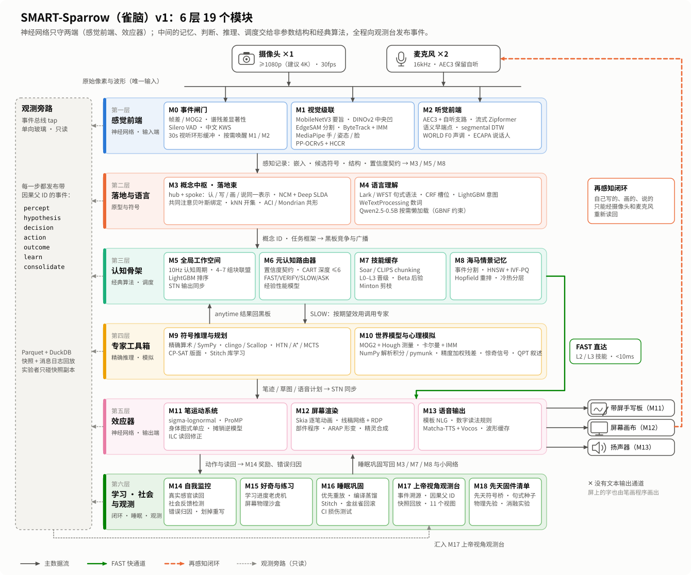
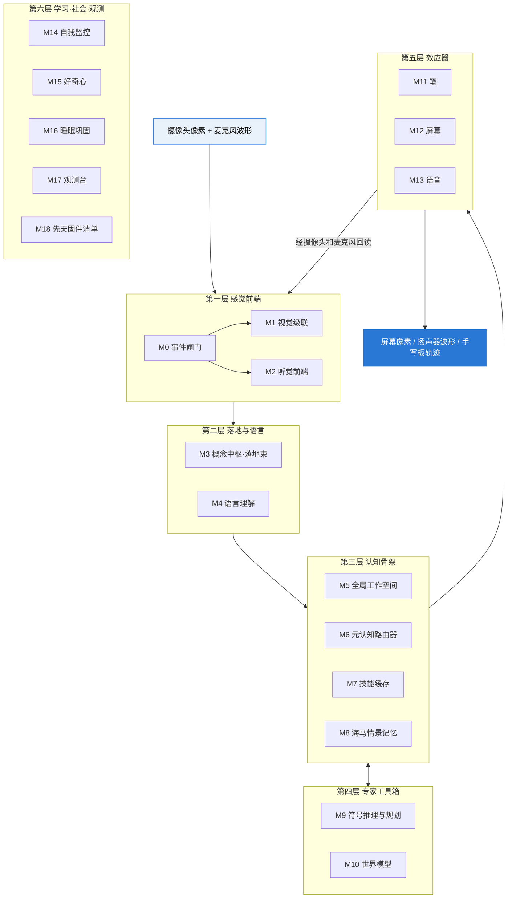

# SMART-Sparrow 设计文档：雀脑 v1

**参数不到 10 亿，只靠眼睛和耳朵学习，越练越快也越懂，每一步都看得见：一只小型通用智能体的设计方案**

---

## 这是什么

这个目录存放 SMART 项目的第一个具体智能体 **SMART-Sparrow（中文名“雀脑”）** 的设计文档。

[科普专栏](../blog/README.md)讲的是通用人工智能的来龙去脉，这里讲我们打算**怎样动手造一只“麻雀”**：它由哪些模块组成，每个模块用什么算法，为什么这样选，怎样观察它学习，以及接下来按什么顺序做、用什么实验来检验。

文档面向两类读者：

- **开发者和研究者**：可以把它当作一份可以直接开工的规格说明，里面有模块清单、参数预算、延迟估算、遥测格式和实验指标。
- **AI 爱好者**：每篇开头都有通俗的解释和图示，跳过技术表格也能看懂整体思路。

## 一、我们要解决什么问题

设想一个坐在桌前的“数字幼儿”：它有一个摄像头当眼睛、两只麦克风当耳朵；它能在屏幕上画画、用扬声器说话、在一块带屏手写板上写字。老师可以指着一个玩具告诉它名字，在白板上写一道算术题，或者让它写一个字、画一个东西。

我们给它定了四条核心要求：

| 核心要求 | 具体含义 |
|---|---|
| **人类同款 I/O** | 运行时的输入**只有**摄像头的原始像素和麦克风的原始波形；输出**只有**三路：屏幕像素、扬声器波形、手写板轨迹 (x, y, 压力, t, 抬笔/落笔)。没有键盘，也没有文本输出，文字只能靠“看到字”或“听到话”进入系统 |
| **低算力** | 神经网络参数总量低于 10 亿（1B）；能在笔记本或 Jetson 这类边缘设备上实时运行；用一台单卡工作站就能训练 |
| **熟能生巧** | 熟悉的任务要快；见过、学过的东西，要越来越快、越来越准、越来越懂，而且这种进步能用数字量出来 |
| **可观测** | 有一个“上帝视角”平台，能看到它此刻在想什么、学到了什么、是怎样学会的 |

另外还有两条工程要求：**有机组合**，即每种算法都用在它最擅长的地方，不把所有事都塞给一个大网络；**只用现有技术**，即只采用真实存在、经过核查的开源组件。

为了让讨论落到实处，所有设计都拿同样四个场景来检验：

| 场景 | 内容 | 考察什么 |
|---|---|---|
| **S1 熟悉任务** | 老师说“写一个‘大’字”，它在手写板上写出来 | 熟练动作够不够快，第一次不会写时怎么学 |
| **S2 少样本新概念** | 老师两次指着一个新玩具说“咕咕”，然后说“画一个咕咕” | 一两次就学会新词和新物体，并能画出来、说出来 |
| **S3 物理直觉** | 小球从斜坡上滚下来，问它“接下来会怎样？” | 能不能在屏幕上画出合理的预测，知道自己何时没把握 |
| **S4 符号推理** | 白板上写着“12+7=” | 看懂手写算式，同时写出“19”、说出“十九” |

## 二、一句话答案

> **以“快慢双通道·算法超市”为主干：神经网络只守输入和输出两端，中间的记忆、判断、推理和调度全部交给可解释的经典算法和可寻址的非参数记忆；在这个底盘上嫁接“一个概念多路读出”的落地束、海马式的互补记忆与晋级阶梯、输出必须经真实感官回读的闭环身体，以及能说出自己没把握的物理预测层；全程事件溯源，由上帝视角平台只读观测。**

换成大白话：

1. **小网络只管“看见”和“听见”**，以及最后“发出声音、画出像素”。想事情、记事情、做决定，交给查表、决策树、规则引擎、物理公式这些又便宜又透明的老办法。
2. **做过的事会“编译”成习惯**：第一次慢慢想，想对了几次就变成规则，再熟就变成查表，最后变成肌肉记忆。每升一级都要过门槛，出错就降级。
3. **一个概念同时会认、会写、会画、会说**：“咕咕”这个概念下面挂着它的样子、它的读音、怎么画它、怎么念它。
4. **自己的输出必须用自己的眼睛和耳朵再检查一遍**：写完用摄像头读回来，说完用麦克风听回来。
5. **每个输出都能追根溯源**：点一下它写的一笔，就能追到是哪段声音、哪块像素、哪条规则引出来的。

## 三、一页纸总览

  

雀脑 v1 分 6 层、19 个模块（M0–M18）：

关键数字（均为核查修正后的估算，需在 MVP 中实测）：

| 项目 | 数值 |
|---|---|
| 神经参数：标准配置 | 约 **0.70B**（常驻约 0.18B；按需加载的 Qwen2.5-0.5B 约 0.49B；线稿网络和适配器约 0.02B） |
| 神经参数：上限 / 超轻配置 | 上限约 0.86B（含研究预留），低于 1B；超轻配置约 0.13B（不装语言模型） |
| 熟悉任务的决策时间 | **< 10ms**（查表、决策树、规则匹配） |
| 熟悉任务端到端（话音结束到落笔） | GPU 约 0.35–0.6s，CPU 约 0.5–0.9s，主要花在语音端点检测和识别上 |
| 算力 | 空闲 < 5 GFLOPs/s；活跃感知约 50–120 GFLOPs/s；纯 CPU 降级约 25–50 GFLOPs/s |
| 运行内存 | 约 2–4GB |
| 目标硬件 | RTX 4060 笔记本 / Jetson Orin NX；可降级到 8 核笔记本 CPU |
| 训练 | 单张 RTX 4090 约 3–5 周；上线后每晚“睡眠巩固” 0.5–2 GPU·小时 |
| 研发规模 | 3–4 人团队约 12 个月 |

它和“一个端到端大模型”路线的区别，可以这样对照：

| | 端到端大模型路线 | 雀脑 v1 |
|---|---|---|
| 知识存在哪 | 神经网络权重里 | 概念库、情景库、规则库、技能表等可寻址的外部结构里 |
| 熟悉任务 | 每次都完整跑一遍网络 | 查表、走规则，决策毫秒级 |
| 长期记住新东西 | 通常要微调权重，有遗忘风险 | 一次写入即可使用，夜间再巩固，旧知识只增不改 |
| 能否解释输出 | 难以追溯 | 每个输出都能沿因果链回溯 |
| 语言与开放世界 | 强 | 弱，这是有意的取舍 |

“有机组合比同等预算的端到端拼装更省、更懂”目前**还只是假设**。我们在[路线图](04-roadmap-and-experiments.md)里安排了专门的对照实验（E8）来检验它。

## 四、文档导航

| 篇目 | 标题 | 你将了解 |
|---|---|---|
| 总览 | 本页 | 问题定义、一句话答案、关键数字、与实现仓库的关系 |
| 第一篇 | [五条候选路线与评审](01-five-routes.md) | 五条完全不同的设计思路、各自的优缺点、核查发现的问题、评分对比，以及为什么选 C 为主干并嫁接 A/B/D/E |
| 第二篇 | [雀脑 v1 综合架构](02-sparrow-architecture.md) | 设计原则、身体与 I/O、6 层 19 个模块、快慢通道、在线学习与睡眠巩固、S1–S4 走查、参数预算、先天固件清单 |
| 第三篇 | [上帝视角观测平台](03-god-view-platform.md) | 20 个视图、主界面线框、遥测格式、平台架构、工具选型、开销控制与隐私 |
| 第四篇 | [路线图与关键实验](04-roadmap-and-experiments.md) | 分阶段计划、12 个关键实验及量化指标、风险与待解问题、如何参与 |

阅读建议：

- **只想知道大概**：读本页，再看第一篇的第七节“结论”。
- **想参与开发**：按顺序读完第二、三、四篇，重点看模块表、遥测 schema 和路线图。
- **想做研究**：第一篇的“共同缺口”和第四篇的“风险与待解问题”列出了尚未解决的开放问题。

## 五、与 SMART-SPARROW 实现仓库的关系

| | 本目录（`SMART-GAI/.github` 的 `design/`） | [SMART-SPARROW](https://github.com/SMART-GAI/SMART-SPARROW) |
|---|---|---|
| 回答的问题 | 为什么这样设计，要造成什么样 | 具体怎么写代码实现 |
| 内容 | 路线比较、架构规格、观测平台设计、路线图与实验 | 源代码、测试、模块接口、实测数据 |
| 更新节奏 | 设计有重大变化时更新 | 持续开发 |

**v0.1 正在 SMART-SPARROW 仓库中实现**，采用“模拟托儿所 + 经典算法 MVP”的方式：在模拟环境中用经典算法先把闭环跑通。这与本设计第四篇中“阶段 0：先搭身体和观测底座”的思路一致。具体实现范围和进度以该仓库为准。

两边的协作方式：

- 设计上的改动（新增或替换模块、改变预算、调整先天固件清单）先在本仓库提 Issue 或 Pull Request 讨论。
- 实现中发现的设计问题、以及 MVP 实测得到的真实数字，回写到这里，替换文中的估算值。

## 六、术语小词典

| 术语 | 通俗解释 |
|---|---|
| **快通道 / 慢通道** | 熟悉的事查表或走规则直接做（快）；不熟悉的事调用专家慢慢想（慢） |
| **L0–L3 四级阶梯** | 技能的熟练等级：L0 深思，L1 编译成规则，L2 查表，L3 运动自动化 |
| **置信度契约** | 每个判断模块都要交出的一组数字：校准概率、共形集大小、新颖度、前两名的差距、预计代价 |
| **FAST / FAST+VERIFY / SLOW / ASK** | 路由器的四种决定：直接做 / 先做再核对 / 慢慢想 / 开口问人 |
| **落地束** | 一个概念下面挂的全部“读出方式”：样子、读音、写法、画法、发音、关系、物理属性 |
| **全局工作空间（黑板）** | 所有模块共享的“意识舞台”，每 100ms 选出少量内容广播给全体模块 |
| **情景记忆（海马）** | 一次写入就能检索的经历库：何时、看到什么、听到什么、做了什么、结果如何 |
| **睡眠巩固** | 空闲或夜间把白天的经历整理成规则、原型和小网络的更新，并做防遗忘检查 |
| **巩固指数 CI** | 关掉情景记忆检索后的准确率 ÷ 打开时的准确率，接近 1 说明真正学会了 |
| **理解深度 UD** | 衡量“有多懂”的综合分数：落地模态数、知识图谱连接、关联技能、预测误差、使用次数、CI |
| **先天固件** | 出厂时就写进去、不是自己学会的知识，必须公开列清单 |
| **先天符号桥** | 语音识别、文字识别、语音合成共用同一套汉字和拼音标签，使“听到的大”和“看到的大”天生对齐 |
| **实验者通道** | 观测平台上暂停、编辑、干预的操作通道，与系统的学习数据严格隔离 |
| **事件溯源** | 系统的每个动作都记录为带“因果父 ID”的事件，可以一路回溯、回放 |
| **共形集** | 一组“以设定概率包含正确答案”的候选；集合里不止一个时说明看不清 |

## 七、读前须知：几点诚实声明

- **数字都是估算。** 文中的参数量、算力和延迟来自公开规格和工程估算，已经按核查意见修正（例如分清 FLOPs 和 MACs、把语音端点等待算进延迟），但仍要以 MVP 实测为准。标注“待核实”的项目尚未查实。
- **它不是从零学起的。** 雀脑使用了预训练的视觉、语音编码器和语音合成器，还预置了数字读法、笔顺通则、句式种子等规则。这些都列在“先天固件清单”里公开，并计划用消融实验量化它们的贡献。
- **它的语言能力很浅。** 雀脑擅长“越熟越强”，不擅长“第一次就很强”；开放式对话、复杂阅读理解不是它的目标。
- **核心假设尚未证实。** “有机组合更省、更懂”需要实验对照来检验；如果实验结果不支持，我们会如实修改设计。

---

## 关于本文档

本设计由 [SMART 项目](../profile/README_CN.md) 社区编写，综合了五份独立的候选方案、逐项的事实核查和评审意见，内容截至 2026 年 9 月。

配图位于 [`images/design/`](../images/design/)。如发现错误、过时的数字或更好的方案，欢迎提交 Issue 或 Pull Request。
